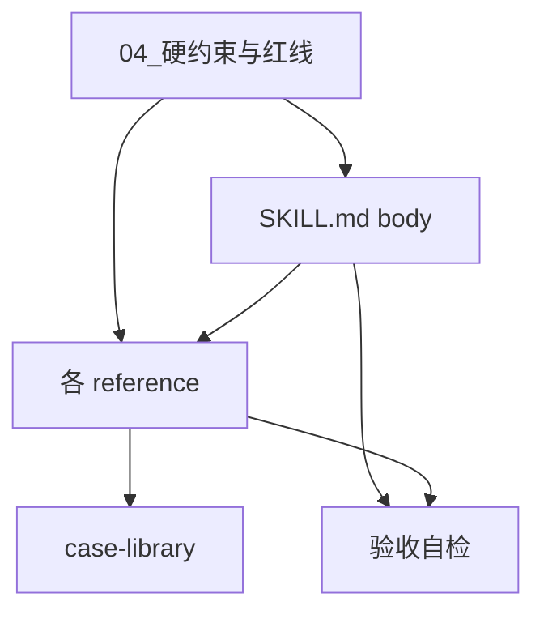

# 01 你要造什么

> 产物清单 + 依赖顺序。**标 ⏳ 的还没定，不能动工**；标 ✅ 的可以开工。
> 每个产物的详细规格在 `02_SKILL.md施工规格.md` / `03_references施工规格.md`。

---

## 一、总览

```
char-build-guide/
├── SKILL.md          ⏳ 体量待定（C3）｜逐段规格见 02
└── references/       ⏳ 切分维度待定（C2）｜逐文件规格见 03
```

**两个最基础的结构问题还没拍板**，所以本文件目前只能给出"确定要有的东西"，不能给出最终文件树：

| 待定 | 是什么 | 卡住谁 |
|---|---|---|
| **C2** | references 按**方法论构件**切（调色盘/多面性/混色/核心人格层/二次解释/意象）还是按**追问动作**切（标签压缩/为什么/世界观/面/瞬间/核心/NSFW/误读/意象），还是二维共存 | 整个 `references/` 的文件清单 |
| **C3** | `SKILL.md` 体量 ~100 / ~150-180 / ~250-300 行——取决于 4 个基础诊断的判定树进不进 body | `SKILL.md` 的段落清单 |

---

## 二、无论 C2/C3 怎么拍，这些内容一定要有

按内容而非文件组织。拍板后这张表会被映射成文件树。

### body 一定要有的（每一轮都用得上的方向感）

| # | 内容 | 为什么必须常驻 | 状态 |
|---|---|---|---|
| B1 | **身份声明**：我是追问引擎，不是知识手册 | 缺了 AI 默认行为是解释概念而非追问 | ✅ |
| B2 | **追问深度轴**：标签 → 具体行为画面 → 矛盾/反差 → 为什么选这条路 → 绝对不变的内核 | 每轮对照判断"用户现在在哪一层，该往哪推" | ✅ |
| B3 | **硬铁律**：不替用户生成内容；用户说"不知道"就换角度不替她生成 | LLM 最强的默认冲动是补全，必须用最强语气写 | ✅ |
| B4 | **执行语言 vs 教学语言的姿态校准** + 2-3 组正反对照句 | 一次到位校准语感（"追问她哪个特质是一直在的" ≠ "底色是什么"） | ✅ |
| B5 | **判停标准**：遮住名字还能认出她吗 | 判断"这一层够深了还是继续追" | ✅ |
| B6 | **4 个基础诊断**：泛化 / 矛盾 / 结论 / 扁平，三级判定 + 跨诊断优先级 | 每轮都要跑 | ⏳ 进不进 body 看 C3 |
| B7 | **流程地图**：模块列表 + 每模块一句话定位 + 指向 references 的触发指针 | 知道"现在在哪、下一站去哪" | ⏳ 依赖 C5 阶段模型 |
| B8 | **入口意识**：用户可能从画面/标签/背景/空白/现成卡进来 | 避免假设所有用户都从标签入口进 | ✅ |
| B9 | **标志性问法样本**（措辞内化） | 追问品味只能靠原句内化，转述会丢 | ✅ 素材 `S1` |
| B10 | **降级模式链**：镜子 → 脚手架 → 推演 → 溯源 → 降级路径，切换依据是**产出质量不是固定轮数** | 卡住时 AI 扮演什么角色 | ⏳ 与 G6 阶梯的分工看 C13 |

### references 一定要有的（阶段性才需要的操作手册）

| # | 内容 | 触发条件 | 状态 |
|---|---|---|---|
| R1 | 调色盘操作手册（含标签压缩、为什么追问） | 该进调色盘了 | ✅ 内容确定，文件归属看 C2 |
| R2 | 多面性（触发标准 + 五部件 + 过渡/渗透 + 何时不需要） | 发现 ≥2 个压力性质截然不同的场景 | ✅ 同上 |
| R3 | 混色（物理事实反差技法 + 追问陷阱 + 不适合的判断标准） | 两个颜色在同一画面中打架 | ✅ 同上 |
| R4 | 核心人格层（七部件 + 从调色盘推演 + 何时不需要） | 追问到"为什么选这条路"但用户说不清 | ✅ 同上，**且已被 D-01 定型**（见 §三） |
| R5 | 二次解释（触发时机 + 格式模板 + 防误读措辞范例） | ⏳ 触发时机看 M-32（组装阶段统一生成 vs 每层完成后） | ⏳ |
| R6 | 路由逻辑（多入口路由 + 模式切换 + MVC 判读 + 收束规则） | 交互开始 / 到达里程碑 | ⏳ 依赖 C5/C12 |
| R7 | 案例库 | 不确定追问方向是否正确时对照 | ⏳ 案例选哪几个未定 |
| R8 | 题库（24/80/200，按 80 问十组目标分组） | 用户明确卡壳、开放式追问连续多轮无产出 | ✅ 素材 `S5` |
| R9 | 常见错误清单 + 自检列表 | 交互感觉不对，或完成一个模块后 | ⏳ 12 失败模式 + 6 执行风险待去重 |
| R10 | 用户确认信号定义（含**假信号黑名单**） | MVC 暂停或收束时 | ✅ |
| R11 | 快速路径（基础信息→小传→采访→情绪阈值→意象 五步） | 深入模式连续卡住 | ✅ |
| R12 | 人物文档落盘机制（四层布局 + 三档状态 + 轮后静默拆解 + 埋没点登记） | 全程 | ✅ 素材 `S7` |

---

## 三、已经被拍板定死形态的部分

### D-01 · 挖"为什么"这一层（对应 R4 核心人格层）

**已定死，不要再设计**：

| # | 规则 | 形态要求 |
|---|---|---|
| 1 | 卡住时抽**该部件的行为题**，不引入任何解释体系 | 问句。素材 `S1` |
| 2 | 产出物写成**"条件-动作"运行规则** | `当…… → 角色会……` 触发表 |
| 3 | AI 反推的产物走**"高可能推论"区块 + 四条围栏** | 独立区块，格式「角色可能存在……但仍需要用户确认……」 |
| 4 | 作者始终说不出核心矛盾 → **跳过这一层** | 兜底次序：追问一次 → 抽行为题 → 仍说不出则不写 |

**禁止**：任何心理学框架（依恋理论/防御机制理论/认知图式/社会学习/荣格/大五…）；任何成因式表述（「她因为 X 所以 Y」）。心理学词汇**只允许作七部件的槽位名**，槽位内容必须是行为。

详见 `05_已定决策速查.md` D-01 与 `三线碰撞/09_拍板记录.md`。

---

## 四、依赖顺序（写作顺序）



**规则**：

1. **先读完 `04_硬约束与红线.md`**，它约束后面所有写作
2. **先写 `SKILL.md` body**——它决定 references 的触发指针怎么写；references 里凡是"body 已经说过的"就不重复
3. **`case-library` 最后写**——它要对齐 body 的判停标准，body 没定它写不准
4. **每写完一个文件立刻跑 `06_验收.md` 的对应自检**，不要攒到最后

---

## 五、其余 3 个 skill

`char-build-guide` 是**阻塞项，必须先写完**。另外 3 个（`dialogue-persona` / `worldbook-config` / `user-info-calibration`）的 B 段都要引用它，写定后可并行。

它们各自的交接包**本轮不做**。这里只记边界，防止你把不属于 `char-build-guide` 的内容写进来：

| skill | 管什么 | 教程依据 |
|---|---|---|
| `dialogue-persona` | 台词人设。与调色盘是**排他替代**（"一个角色要么用调色盘写，要么用台词人设写"），不是叠加层 | `3.md:35` |
| `worldbook-config` | 世界书**机制配置**（蓝灯/绿灯/位置/深度/递归/关键词）。⚠️ 与"世界观内容体量"是两个对象 | `0.md:597-599` |
| `user-info-calibration` | 用户信息。"角色卡是给 AI **演**的，用户信息是给 AI **读**的"；对不抢话党**明确禁写调色盘** | `9.md:15-21`、`:240-252` |

**这四件事教程明文排除在追问引擎之外**（执行器四禁）：不要输出完整角色卡格式、不要写开场白、不要写世界书、不要写台词人设成品。追问引擎的下游清单只有五个：调色盘、混色、三面性（多面性）、核心人格层、二次解释。
