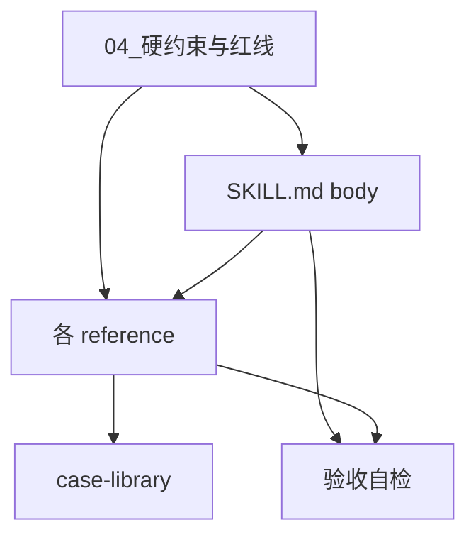

# 01 你要造什么

> 产物清单 + 依赖顺序。**标 ⏳ 的还没定，不能动工**；标 ✅ 的可以开工。
> 每个产物的详细规格在 `02_SKILL.md施工规格.md` / `03_references施工规格.md`。

---

## 一、总览

```
char-build-guide/
├── SKILL.md          ⏳ 顺序与体量待定（冲突 C3）｜逐段规格见 02
└── references/       ⏳ 切分维度与命名待定（冲突 C2）｜逐份规格见 03
```

**两个结构问题没拍板，但它们只决定"怎么归组、叫什么名"，不改内容。** 所以下面按**内容块**给清单——冲突 C2/C3 拍板后只是把这些块映射成文件，不需要重写。

> 本文件里的所有 `C+数字` 都是**待拍冲突编号**（与素材分节号、`06` 验收项编号同形不同物，见 `00` §二）。

| 待定冲突 | 是什么 | 卡住什么 |
|---|---|---|
| **冲突 C2** | references 按**方法论构件**切还是按**追问动作**切，还是二维共存 | 文件清单和命名 |
| **冲突 C3** | `SKILL.md` 体量 ~100 / ~150-180 / ~250-300 行——取决于 4 个基础诊断的判定树进不进 body | 段落顺序和行数预算 |

---

## 一之二、产物格式规范 ⚠️ 写第一个字符之前先看这节

> 这一节 2026-08-15 补入。**缺了它，1-9 段全写完拿到的东西也不是一个 skill**——没有 frontmatter 的 `SKILL.md` 不会被加载。

### `SKILL.md` 的 YAML frontmatter（必须有）

```yaml
---
name: <slug>
description: |
  <触发描述，见下方规则>
---
```

| 字段 | 规则 |
|---|---|
| `name` | 用冲突 C14 拍板后的 slug。**⏳ 冲突 C14 未拍前写 `char-build-guide` 作占位**，并在文件头部注释一行「slug 待冲突 C14 确认」 |
| `description` | **中英双写**（纯英文触发率低，已诊断确认）。必须覆盖：五类触发场景的语言信号 / 与三个兄弟 skill 的边界信号 / 排除项。**不要**让"角色"成为唯一锚点，**不要**放内部术语。详细七条共识见台账 T-128 |

### reference 文件的头部

每份 reference 开头必须有一行题注，说明**这份手册什么时候被读**——与 body 的触发指针（`02` §11a）对应，措辞取同一句。不需要 YAML frontmatter。

### 目录结构

```
char-build-guide/          ← 目录名 = slug，⏳ 冲突 C14
├── SKILL.md
└── references/
    └── <各手册>.md         ← 文件名 ⏳ 冲突 C2
```

**⏳ 的部分怎么办**：用占位名先写，并在文件头部显式标注「占位，待冲突 C2/C14 替换」。**不要因为名字没定就不写内容**——内容和名字是两件事。

---

## 二、SKILL.md body 的内容块

规格在 `02_SKILL.md施工规格.md`，一一对应。

| # | 内容块 | 状态 |
|---|---|---|
| 1 | 身份声明 | ✅ 规格已定 |
| 2 | 人物文档 ≠ 运行时卡 | ✅ 规格已定 |
| 3 | 追问深度轴 | ✅ 规格已定 |
| 4 | 硬铁律 | ✅ 规格已定 |
| 5 | 执行语言 vs 教学语言（姿态校准） | ✅ **D-02 已定，可直接开工** |
| 6 | 判停标准（遮名测试） | ✅ 规格已定 |
| 7 | 入口意识（五种入口） | ✅ 规格已定 |
| 8 | 标志性问法样本 | ✅ 规格已定（素材待提） |
| 9 | 推演权限 | ✅ **D-01 已定，可直接开工** |
| 10 | 4 个基础诊断 | ⏳ 冲突 C3（进不进 body）+ 冲突 C6（4 个还是 3 个） |
| 11 | 流程地图 + references 触发指针 | ⏳ 冲突 C5（**触发指针那一半不受阻塞**，见 `02` §11a） |
| 12 | 降级模式链 | ⏳ 冲突 C13 |

---

## 三、references 的内容块

规格在 `03_references施工规格.md`，一一对应。

| # | 手册 | 量级 | 状态 |
|---|---|---|---|
| 1 | **核心人格层** | ~55 行（估算）/ 8-15 轮 · 重 | ✅ **D-01 已定，素材已提，可直接开工** |
| 2 | 调色盘 | ~40 行 / 4-7 轮 | ✅ 规格已定，**素材已提** |
| 3 | 多面性 | ~50 行 / 8-15 轮 · 重 | ✅ 规格已定，**素材已提** |
| 4 | 混色 | ~25 行 / 3-6 轮 | ✅ 规格已定，**素材已提** |
| 5 | 二次解释 | ~20 行 / 2-3 轮 | 🟡 规格已定（含时机冲突裁定），**素材已提**；质量门 6 新增一条待裁定 |
| 6 | 意象 | ~15 行 / 1-2 轮 | 🟡 **素材已提**；5 条可开工，4 条无教程依据已降级待冲突 C12；位置依赖冲突 C11 |
| 7 | 题库 | — | ✅ 规格已定，**素材已提** |
| 8 | 用户确认信号 | ~15 行 | ✅ 规格已定 |
| 9 | 快速路径 | ~40 行 | ✅ 规格已定（三处依赖冲突 C12/C13） |
| 10 | 人物文档落盘机制 | — | ✅ 规格已定（两处依赖冲突 C10/C11） |
| 11 | 路由逻辑 | — | ⏳ 冲突 C5、C12、C13 |
| 12 | 案例库 | — | ⏳ 案例选哪几个（冲突 C9 部分已解锁） |
| 13 | 常见错误清单 | — | ⏳ 冲突 C2（12 失败模式 + 6 执行风险去重）。**呈现形态已定**：失败模式**按严重度分三档**——**致命级**（毁掉角色）→ **严重级**（降低质量）→ **中等级**（影响细节）。**AI 优先防致命级**；致命级四条 = AI 扩写污染 / 衍生给 AI 写 / 强行拆面 / 调色盘与台词人设混用 |
| 14 | 世界观锚定 / NSFW 动机追问 | ~15 行 | ⏳ 冲突 C2（线 C 有，线 B 无对应，归宿未定） |
| — | **4 诊断的外部问法与质量门** | — | ⏳ 归宿卡冲突 C2/C3。**内容部分已有**：线 C `diagnostics/4-basic-diagnostics-precise-criteria.md` 每诊断各 1 句外部问法（`:77` 泛化 / `:242` 矛盾 / `:344` 结论 / `:529` 扁平）+ `§7.2` 语气映射 + `§7.3` 跨诊断质量门。**缺的是数量不是有无**——通用规格要求每诊断 2-4 句，现有 1 句 |

---

## 三、已经被拍板定死形态的部分

### D-01 · 挖"为什么"这一层（对应 §三 的核心人格层手册）

**已定死，不要再设计。** 结论摘要在 `05_已定决策速查.md`，完整施工规格在：

| 你要写的 | 去读 |
|---|---|
| 核心人格层操作手册 | `03_references施工规格.md` §核心人格层操作手册（**内容已全定，可直接开工**；只有文件名待冲突 C2） |
| `SKILL.md` 推演权限段 | `02_SKILL.md施工规格.md` §推演权限段（**已全定，可直接开工**） |
| 两者的红线 | `04_硬约束与红线.md` H-01 ~ H-05、S-11 |
| 两者的素材 | `素材/核心人格层_原文素材.md`（已提取，八块 A–H） |
| 写完自检 | `06_验收.md` 对应两节 |

**这两处是目前唯二可以立刻动工的产物。**

---

## 四、依赖顺序（写作顺序）



**规则**：

1. **先读完 `04_硬约束与红线.md`**，它约束后面所有写作
2. **先写 `SKILL.md` body**——它决定 references 的触发指针怎么写；references 里凡是"body 已经说过的"就不重复
3. **`case-library` 最后写**——它要对齐 body 的判停标准，body 没定它写不准
4. **每写完一个文件立刻跑 `06_验收.md` 的对应自检**，不要攒到最后

---

## 五、其余 3 个 skill

`char-build-guide` 是**阻塞项，必须先写完**。另外 3 个（`dialogue-persona` / `worldbook-config` / `user-info-calibration`）的 B 段都要引用它，写定后可并行。

它们各自的交接包**本轮不做**。这里只记边界，防止你把不属于 `char-build-guide` 的内容写进来：

| skill | 管什么 | 教程依据 |
|---|---|---|
| `dialogue-persona` | 台词人设。与调色盘是**排他替代**（"一个角色要么用调色盘写，要么用台词人设写"），不是叠加层 | `3.md:35` |
| `worldbook-config` | 世界书**机制配置**（蓝灯/绿灯/位置/深度/递归/关键词）。⚠️ 与"世界观内容体量"是两个对象 | `0.md:597-599` |
| `user-info-calibration` | 用户信息。"角色卡是给 AI **演**的，用户信息是给 AI **读**的"；对不抢话党**明确禁写调色盘** | `9.md:15-21`、`:240-252` |

**这四件事教程明文排除在追问引擎之外**（执行器四禁）：不要输出完整角色卡格式、不要写开场白、不要写世界书、不要写台词人设成品。追问引擎的整理方向**必须服务于**：调色盘、混色、三面性（多面性）、核心人格层、二次解释。⚠️ 这是正向要求不是排他清单——意象、基础信息、人物文档落盘也是本 skill 的产物。
