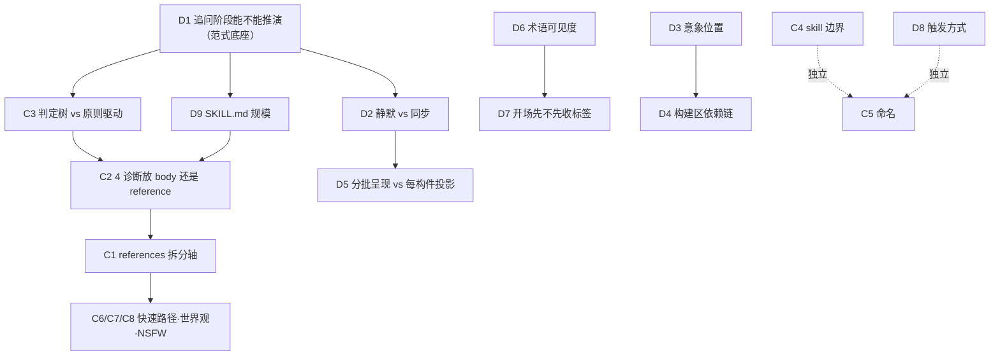

# A/B/C 三套决策记录碰撞融合分析（过程文件）

> **文件定位**：本文件**不做决策**，只做碰撞。把三条平行探索线的全部结论摆在一起，标出「哪些是独立收敛的共识」「哪些是一方空缺一方有成品的互补」「哪些是必须由用户裁决的真冲突」「哪些看起来打架其实不打架」。
>
> **为什么需要它**：用户在多个方向分别与 AI 做了探讨，产生了三套独立的决策记录。它们**没有明确的先后取代关系**，不能用"谁更新"来裁决。合并基线确定之前，任何一条线单独推进都会返工。
>
> **状态标记**：🟢 独立收敛共识（可直接作为公共前提）/ 🔵 互补（可直接嫁接，不需裁决）/ 🔴 真冲突（必须用户裁决）/ ⚪ 伪冲突（辨析后即可关闭）/ ⬜ 合并后新增空缺
>
> **版本**
> - v1（2026-08-13）：A 线 × B 线碰撞
> - **v2（2026-08-13）：补入 C 线（`没有明确要求禁止读/` 的 handoff 三件套）。C 线恰好覆盖 A 线 §12.7「范围说明」自己声明"不在本次审查范围"的全部五项（MVC 时机 / 构建顺序 / 意象位置 / 产物名 / 多框架推演）。**

---

## 〇、三条线的身世对照

| 维度 | **A 线** `books/xingge-tiaosepan/` | **B 线** `性格调色盘/books/char-palette/` | **C 线** `没有明确要求禁止读/` |
|---|---|---|---|
| 项目代号 | 蒸馏线 | 追问线 | `character-palette-collab` |
| 核心范式 | **追问引擎** | **诊断 + 追问** | **推演引擎**（人给素材 → AI 用心理学框架推演 → 人裁决） |
| 蒸馏切口 | cangjie 五 agent（框架/原则/案例/反例/术语） | 3 个 knot agent 专攻追问技法 | 直接设计 + 三轮独立审查 + 实操演练 |
| 提取单元 | 框架 f01–f18 | 追问动作 #1–#14 | 设计决策 §2.1–§2.23 |
| 主 skill 名 | `char-build-guide` | `char-builder` | `character-palette-collab`（另有 `char-creator` 雏形） |
| SKILL.md 规模 | ~80–120 行 | ~150–180 行 | **~250–300 行**（从 2000+ 压缩而来，有实证） |
| references | 方法论模块，11 个 | 追问动作，9 个 `probe-*.md` | 方法论模块，6–8 个 |
| 深度集中在 | 执行框架·节奏·运行时承载·快速路径·引导阶梯 | 诊断判定标准·追问动作定义·外部问法样例 | **推演机制·交互契约·问题目标层·命名方案** |
| 验证方式 | agent 交叉验证（多轮多组） | 5 agent 独立设计后综合 | **三轮独立审查 + 逐条反面验证 + 9 轮实操演练** |
| 关键文档 | `CHAR_BUILD_GUIDE_DESIGN.md`（1263 行） | `ARCHITECTURE_DECISION` + `DIAGNOSTICS_DECISION` | `DESIGN_HANDOFF.md`(695) + `_REVISION.md`(372) + `DESIGN_DISCUSSION_01.md`(376) |
| 时间线 | 08-10 → 08-13 | 08-13 落盘 | **08-04 → 08-07（最早）** |
| AGENTS.md 地位 | 点名「唯一权威主文档」 | 未列入 | 仅在 A 线 §〇 0.5 被引为"记录方式对标物" |

**三句话对照**：

- **A 线**回答"这台引擎怎么跑起来、跑多久、跑完东西放哪"
- **B 线**回答"这台引擎每一轮到底在判什么、判完说什么话"
- **C 线**回答"**用户说不出来的时候，AI 凭什么造出候选、造完怎么交付、交付时说什么**"

### ⚠️ C 线的时间地位需要澄清

C 线是**最早**的（08-04~08-07），A 线在 §12.7 明确审阅过它，但**只审了承载机制**，并写下：

> **范围说明**：仅审阅承载机制（素材/状态怎么承载）。handoff 中 **MVC 时机、构建顺序、意象位置、产物名、多框架推演**等非承载机制内容，**不在本次审查范围**——那些问题以后讨论时再单独审。

**本轮碰撞正是在补这一刀。** 那五项在 A 线后来都独立做了决策（§4.3 MVC / L4 构建区顺序 / L2 意象位置 / L1 产物名），但**没有与 C 线的原始立场对照过**——所以不是"C 已过时"，而是"两边各自定了，还没对账"。

---

## 一、🟢 独立收敛的共识

> **方法论意义**：这些是**提取单元不同、agent 不同、验证路径不同**的流水线各自独立得出的相同结论。三线收敛的证据强度最高。

### 1.1 三线收敛（最强）

| # | 命题 | A | B | C |
|---|---|---|---|---|
| 1 | 追问/协作引擎 ≠ 知识手册 | §1.1 | `ARCHITECTURE_DECISION` 全篇 | REVISION §1.1「SKILL.md 是决策引擎不是知识库」 |
| 2 | 教程顺序 = 教学逻辑，不是构建逻辑 | 「翻译层」 | `PIPELINE_STATE` 决策 3/4 | 大原则 2 |
| 3 | 三面性 → 多面性（面数由角色定） | `ARCHITECTURE.md` §七 | 决策 5 | §2.7 |
| 4 | 硬规则：只出行为场景，禁止出形容词 | E 决策 4 衍生合格标准 | 泛化+结论双诊断 | §2.11 / 红线 2 |
| 5 | 接管已有设定，不要求重走流程 | E 决策 3 | #7 入口分流 | §2.9 第零步 |
| 6 | 用户主权：说停就停，用户裁决不可上诉 | §2.4 + E 决策 4 | 运行规则 | 红线 5 + REVISION §6.4 |
| 7 | 引导而非说教，教学是附带收获 | §1.3 | 决策 3 | §2.1c / §2.15c |
| 8 | 人物文档 ≠ 最终运行时卡 | L11 | —（B 未涉及） | §2.3b + DISCUSSION 全局区分 |
| 9 | 意象需要全貌才能凝聚，可以找不到 | §4.4 + G3 | 决策 11 | §2.23 |

### 1.2 A×C 收敛（B 未涉及）

| # | 命题 | A | C |
|---|---|---|---|
| 10 | **原则驱动 > 规则穷举** | §1.2 + §0.6 演进表 | REVISION §6.1「否决模式太多样，预设分支会覆盖不全且误导 AI。不如给判据、信 AI 判断」 |
| 11 | **剔除说服性内容——skill 读者是 AI，不需要被说服** | §0.6 | REVISION §1.1 +§6.4「skill 的读者是另一个 AI 实例，不需要'自己能力限度'的声明」 |
| 12 | 单文件人物文档（素材区+构建区） | §12.2 | §2.2 / §2.3（A 明确引用 C） |
| 13 | 事件驱动记录（闭环即记，每轮不自动写） | §12.3 | §2.12（A 明确引用 C） |
| 14 | 素材区推演价值判据（四记三不记） | §12.5 | §2.3c（A 明确引用 C） |
| 15 | 过程记录取消，角色相关否决进素材区 | §12.4 | §2.4（A 明确引用 C） |
| 16 | 镜子 → 脚手架 → 推演 三层模式 | E 决策 6 | §2.22 + DISCUSSION 决策 4（**A 的措辞直接来自 C**） |

### 1.3 A×B 收敛（C 未涉及或立场不同）

| # | 命题 | A | B | C 的立场 |
|---|---|---|---|---|
| 17 | AI 内部诊断 vs 外部问法两层分离 | §三 + §1.4 | 全篇组织原则 | 一致（§2.15b 内部判断不抛回用户） |
| 18 | 深度层不是关卡，信号触发自然分支 | §3.2 + §4.3 | 决策 9 + 运行规则 3 | 一致（§2.6 步骤分级：条件触发） |
| 19 | 遮名测试是核心判停标准 | §5.1.2 第 5 项 | 诊断一 Step 1 | 一致（§2.3b 外貌只写特征） |
| 20 | 输出分层（已确认 / AI 推论 / 待决定） | §2.5 + L10 | 运行规则 6 | **更细**：§2.15b 确认 vs 同步二分 |
| 21 | 术语不对用户说 | §1.3 | `ARCHITECTURE_DECISION` 约束 | ⚠️ **部分推翻** → 见 🔴 D6 |
| 22 | 标签是起点不是敌人，先收标签再下钻 | G5 | 决策 1 | ⚠️ **对立** → 见 🔴 D7 |

---

## 二、🔵 互补（可直接嫁接，不需裁决）

### 2.1 B 的净增量（A/C 都缺）

| # | B 的产出 | A/C 的现状 |
|---|---|---|
| **B-1** | **4 个基础诊断的完整判定标准**：三级判定（触发/观察/通过）+ 判定树 + 灰色地带表 + 每诊断 5 正 5 反例 | A 只有 §3.2 六行「深度信号识别」表；C 只有"不许出形容词"这一条硬规则。**两条线都给方向不给判据** |
| **B-2** | 跨诊断优先级 **矛盾 > 结论 > 泛化 > 扁平**；同时触发只处理 1–2 个 | A/C 都无 |
| **B-3** | **矛盾检测的触发器是放大器不是标签本身**（"自卑+成绩好"不触发；"**极度**自卑+成绩好"才触发） | A 的 G5 用的正是这个例子却没给判据；C 完全没有矛盾检测 |
| **B-4** | **结论检测**（摄影机测试 + 瞬间动词 vs 模式动词 + 结论词清单） | A 只在衍生合格标准写「无解释词」；C 的"录像带规则"同源但无判定法 |
| **B-5** | **扁平检测**（伪负面识别 + 方向多样性） | A/C 都完全没有 |
| **B-6** | AI 默认值规则（"黑发黑眼"判触发） | A 仅 §12.5 带过；C §2.3c 有"无辨识度的默认值不记"（记录侧），无诊断侧 |
| **B-7** | 13 个追问动作各自的**外部问法样例**（自然语言、无术语、每个 2–4 条） | A §5.1.2 第 8 项要求但内容空着；C 的问法六类有类型无例句（例句在 references 计划里，未写） |
| **B-8** | `probe-nsfw`（NSFW 动机追问，条件触发） | A 列为覆盖盲区；C §2.15 明确"不做 NSFW 内容" → 见 🔴 C8 |
| **B-9** | 4 个诊断可**反过来**用作已有角色卡体检工具 | A 的「校验模式」是空壳；C 的第零步只做标签化点识别 |

### 2.2 A 的净增量（B/C 都缺）

| # | A 的产出 | B/C 的现状 |
|---|---|---|
| **A-1** | **质量信号表 A–G + 4 条假信号排除**（回答变长≠能看见角色、用了术语≠、说"我知道了"≠、情绪激动≠） | B 只有单点质量门；C 的 MVC 判据是结构性的（调色盘写定），无质量信号 |
| **A-2** | **运行时承载的完整落地**：索引头 / 三档状态 / 埋没点登记回收 / 归档区推翻不删除 / 影响范围 | C 有单文件+素材区/构建区+⏸ 标记，但**没有索引头、没有埋没点机制、没有归档区**；B 完全没考虑落盘 |
| **A-3** | **快速路径 G3 五步的完成标准**（每步 AI 从文本可观察的判据） | C 的 char-creator-skill-path 有五步流程但无完成标准；B 完全没有 |
| **A-4** | **引导升级阶梯 G6 四级**（按**干预强度**分级：钻探链→行为锚定→多选引导→假设场景） | C 的问法六类是按**卡壳类型**分类（正交维度，可叠加，见 🔵 K9）；B 无 |
| **A-5** | **示范边界 G7 三条硬约束**（不写用户的角色 / 只示范一条 / "找到"型任务不示范） | B/C 都无。C 的红线只说"不替代作者决策"，没定义示范 |
| **A-6** | 卡住根因四阶段（物化/展开/收敛/穿透）+ 7 种卡住类型 | C 有三层模式但无根因诊断；B 无 |
| **A-7** | 行为测试修改版（用户自发生成场景）+ 为什么禁止原始版的四条论证 | B/C 都无 |
| **A-8** | 矛盾路由区分（跨场景→多面性线索；同瞬间→混色画面） | B 判出"场景分化不触发"却不知转多面性；C 无 |
| **A-9** | RIA++ 六段 + description 中英双写 + B 段 8 硬 5 软边界 + 12 失败模式 + 6 覆盖盲区 | B 无段落概念；C §2.1 明确"不做触发优化" → 见 🔴 D8 |
| **A-10** | 决策记录 5 问规范 + 三条铁律 | C 的记录质量高但无强制规范；B 更轻 |

### 2.3 ★ C 的净增量（A/B 都缺）— 本轮最大收获

| # | C 的产出 | 为什么有增量价值 |
|---|---|---|
| **C-1** | **多框架推演的完整弹药库**（§2.11）：核心四框架（依恋理论=关系轴 / 防御机制=自我保护轴 / 社会学习=环境学习轴 / 认知图式=认知解读轴）+ 每个框架的推演方向与卡片映射 + 扩展池 8 个（创伤应激/家庭系统/存在主义/印象管理/自我决定/发展任务/荣格阴影/情感调节）+ **筛选标准五条**（生成性/行为落地/结构性差异/领域覆盖/卡片映射）+ **排除理由**（特质论=描述性非生成性、进化心理学=讲共性、沟通分析=与认知图式重叠） | **A 的 E 决策 6「推演模式：从 ≥2 个独立视角各推 1 条」和 A §4.3.3「中性脚手架场景」都缺"视角从哪来"这个弹药库。** C 是三条线里唯一回答了"AI 凭什么造出候选"的 |
| **C-2** | **"反直觉"被废掉 → 真正的问题叫频率偏差**（§2.11） | 对 A 的 f01「AI 是输入法联想」元模型的**精确化修正**："对 AI 来说没有反直觉这回事——数据库里有大量低频但真实的关联，AI 知道，只是默认不会先想到"。**并给出可执行的解法**："不能靠列清单（会被频率偏差和锚定效应双重杀死——AI 列 8 条第一条还是最常见的，用户面对平铺选项会选前几条），要靠从 ≥2 个不同生成轴各推一条" |
| **C-3** | **确认 vs 同步的二分**（§2.15b）：纯过滤→不需确认但**必须同步**；价值判断推进→不需确认但必须同步；产生新内容→**必须确认** | **A/B 都没有这个交互原语。** C 的论证是三条线里最锋利的一条：「纯过滤不同步会引发信任问题——用户下次看文档发现漏了，会怀疑'AI 是不是出 bug 了'，信任直接崩掉。同步一句'这个没有推演价值，我先不记'→ 用户要么认同，**要么揭出一个隐藏经历**（'不不不，她喜欢听音乐是因为那是她爸唯一留给她的东西'——后者恰好暴露重要素材）」→ 见 🔴 D5 |
| **C-4** | **问题目标层**（§2.16）：探明什么（十组方向索引）+ **终点**（教程 7 号"你最低限度要知道"清单：她在什么瞬间会做决定/什么瞬间会认定一件事/压力下的思考顺序/什么时候妥协·否定自己·嘴硬·第一次不嘴硬/会为了什么伤害别人·又为了什么停手）+ 够不够判据（标签下钻五连问 + 闭环判据） | **解决"为问而问"**：C 明确诊断了这个病——"AI 知道要问具体问题，却不知道每个问题在探什么、探到什么算够，会把问法六类当菜单轮着用，永远不收敛"。**A 的 question-bank 只是题库，B 的 6 维度清单只是覆盖检查，两者都没有"终点"定义。** 这份"最低限度要知道"清单可直接补进 A 的 MVC 质量判读 |
| **C-5** | **推演质量保障四层**（§2.19a–d）：输入端（素材够不够推）/ 解析端（**推演前 AI 内部写一句话摘要，三句话写不清 = 素材不够 = 退回追问**）/ 质量端（差异性检查：删掉框架名只看行为描述，几条说的是不同的事吗？同一条换三个角度 = 不合格）/ 失败处理（三种否决 × 三种应对） | **A 的质量信号 A–G 判的是"用户给得够不够好"，C 的四层判的是"AI 自己做得够不够好"——两套完全不同的质量闭环。** 尤其 §2.19b 的"三句话写不清就退回"是一条极廉价的自检 |
| **C-6** | **问法六类 + 按卡壳类型匹配**（§2.9 + DISCUSSION 决策 2）：镜像/反应/具象/关系/反差/决策类，**明确废除"按可答性排序"** | 废除理由与 AGENTS.md 的「教程≠skill」完全同构，但是 C 线**独立发现**的："可答性排序是教学框架（教人先问好答的），不是 AI 执行策略"。反面验证很精彩：「用户说'她很温柔'→ 按顺序先问镜像类'你身边有温柔的人吗？'→ **偏了，用户在想别人而不是角色**→ 再问反应类→ 这已经是推演了→ 再问具象类才问对，**已经浪费两轮**」 |
| **C-7** | **用户角色定位前置**（REVISION §2.2）：世界设定之后立即问"你在这个世界里是什么身份？你和角色的关系是什么？还是说你是旁观者？" | **A/B 都完全没有。** C 的理由："关系不是'素材之一'，它是**角色行为模式所依赖的上下文**。定义关系不是在填素材表的某一格，是在定角色行为的坐标系。"这条直接连接 `user-info-calibration` 的归属问题（🔴 C4） |
| **C-8** | **人物文档 ≠ 运行时卡 必须写在 SKILL.md 开头**（DISCUSSION 全局区分）+ 两条严重后果论证 | A 的 L11 只定了导出边界（用户手动触发、不管世界书格式），**没说这个认知要前置**。C 的两条后果：①"如果 AI 以为自己在直接写运行时卡，会在构建阶段就删推演依据、过度压缩" ②"如果 MVC 时说'可以拿去运行了'，用户把人物文档直接塞进世界书，效果会很差" |
| **C-9** | **MVC 不能用"自然衔接"**的反面论证（DISCUSSION 决策 1） | **C 已经替 A 否决了一个 A 还没想到的坑**：审查 B 曾建议"用对话自然收束代替选项菜单"，被否决——"自然衔接是在**主动推动用户进入下一个构建阶段**，而不是让用户决定停不停。一个只需要简单角色的用户可能被推着走，最后产出过度构建的复杂角色。MVC 决策点的存在价值恰恰是**主动打断这个惯性**" |
| **C-10** | **快照 ≠ 最小可用**的概念澄清（DISCUSSION 决策 1） | "快照是任何时候都能展示的可视化工具，跟角色是否达到运行阈值无关；最小可用是一个质量阈值。**两者没有因果关系**——展示快照不等于到了阈值，到了阈值也不一定要展示快照。" **A 的 L8 索引头（状态地图）和 L10 投影确认（构件展示）有混淆这两件事的风险** |
| **C-11** | **双名并行 + 模型适配**（§2.17 + REVISION §1.3）：产物名（性格质地/场景模式/内在驱动/情感交织/角色边界）+ 首次带括号方法名 | 与 A/B 的"完全不说术语"冲突（见 🔴 D6），但 C 有一条**全新论据**：产物名不只是用户友好，还是**模型适配的 fallback**——"'调色盘'这个隐喻在某些模型上可能失效，但'性格质地'是直白的，不存在理解障碍。产物名本身就是 fallback"。REVISION §1.3 还完整记录了"从批评到采纳的转折逻辑"（最初批评"双名增加认知负担"，前提是 AI 能理解隐喻；模型差异被指出后前提不成立） |
| **C-12** | **蓝图（用户进度看板）**（§2.17）：`身份与经历 ✓ / 性格质地（调色盘）◐ / 场景模式 ○ …` | A 的索引头是**给 AI 看的**恢复层，C 的蓝图是**给用户看的**进度同步。两者不冲突，A 缺后者 |
| **C-13** | **阶段声明只在模式切换时触发**（§2.18）+ 三个切换点（追问→推演 / 槽位→槽位 / 推演完→组装展示） | A/B 都无。用户始终知道"现在在做什么"的最低成本方案 |
| **C-14** | **情景引导的现成弹药**（§2.9 第五步）：现代都市题材的五类具体问题（日常生活类/关系类/反差类/压力类/决策类，按难度递进） | **正好是 A 的 G6 第四级「假设场景/闭上眼指令」缺的弹药库** |
| **C-15** | 规模控制的实证（REVISION §1.1）：2000+ 行 → ~250 行 SKILL.md + ~600 行 references；"context window is a public good"；"handoff 的翻译方式是把'人看的教程'换了个写法变成'AI 看的教程'——信息结构没变，只是换了个读者" | 对 🔴 C2（body 行数）有直接参考——C 是唯一给出过压缩前后对比的 |
| **C-16** | 否决后重推**不预设机制**（REVISION §6.1） | "否决的模式太多样——角色原因否决/风格原因否决/偏好否决——每个对应的合理处理方式不同。预设分支会覆盖不全且误导 AI。" 这是 C 线自己的「原则驱动 > 规则穷举」，与 A §1.2 独立收敛（已收进 🟢 #10） |

### 2.4 🔵 三向咬合（各持一部分，拼起来才完整）

| 咬合点 | A 提供 | B 提供 | C 提供 | 拼起来 |
|---|---|---|---|---|
| **K1 矛盾** | 发现后往哪走（跨场景→多面性 / 同瞬间→混色） | 什么算矛盾（放大器规则、逻辑打架 vs 正常人性 vs 场景分化） | — | 完整的「识别→分类→路由」链。任一方单独都是断的 |
| **K2 泛化** | 判停标准（遮名）+ 质量信号 B | 判定树 + 四类内容分类 + 放大器 + 默认值 | 外貌"只写特征不写美感"的记录侧规则 | ⚠️ 三方措辞不同判的是同一件事，**必须去重**（⬜ G3） |
| **K3 结论** | 记录侧过滤器（L6 录像带规则） | 追问侧诊断器（摄影机测试） | 硬规则"推演禁止出形容词"（生成侧闸门） | 同一把尺子的**三个位置**：记录时过滤、追问时诊断、生成时闸门 |
| **K5 深度分支** | 三种模式的操作手册规划 | 三类信号的具体症状 + 一对一路由 | 步骤分级（必须 vs 条件）+ 各自触发判据 | A 的手册 + B 的信号 + C 的分级 |
| **K6 卡住** | 四级升级阶梯（按**干预强度**） | 各 probe 的外部问法（弹药） | 问法六类（按**卡壳类型**）+ 三层模式 + 情景引导弹药 | 见 K9 |
| **K7 收束** | 人物文档四区 + 三档状态 + 导出边界 | 输出分三类 | 确认 vs 同步二分 + 人物文档≠运行时卡前置 | ⚠️ 三套正交的分类，需要统一（⬜ G1） |
| **K8 追问失效** | 降级链条（**用户**答不出来怎么办） | 同一诊断连续 3 轮触发的降级（**AI 判据**一直不放行怎么办，仅在原始产出 §6.3） | 推演被否决怎么办（**AI 推演**读感偏了怎么办，§2.19d + 每次否决必溯源） | 三条完全不同的失效路径，**三条线各管一条**，合起来才是完整的失效处理 |
| **K9 卡住的二维定位** ★ | 干预**强度**轴（轻→重四级） | — | 卡住**类型**轴（六类问法匹配） | **两个正交维度可以叠加成一张二维表**：先按 C 判"卡在哪类"，再按 A 判"该用多重的干预"。A 的 G6 自己说"先诊断卡住类型再匹配机制，不做无差别'再具体一点'"——**C 的六类正是 A 要的那个类型学** |

---

## 三、🔴 真冲突（必须用户裁决）

### 3.1 原 A/B 冲突 + C 线的投票

| # | 冲突 | A | B | **C 的立场** | 变化 |
|---|---|---|---|---|---|
| **C1** | references 拆分轴 | 方法论模块 11 个 | 追问动作 9 个 probe | **方法论模块 6–8 个**（palette/multiface/color-mixing/core-layer/secondary-explanation/imagery/questioning-strategies） | **A+C vs B**（2:1） |
| **C2** | 4 诊断放 body 还是 reference | body 清单未列 | 必须进 body | **支持进 SKILL.md**：REVISION §2.5 明确否决独立 `anti-patterns.md`，理由"分开存放降低命中率"；且 C 的 SKILL.md 有 250–300 行的空间 | **B+C vs A**（2:1），且 C 解决了体量问题 |
| **C3** | 判定树 vs 原则驱动 | 明确否决 if-else 状态机 | 全套判定树 | **强烈支持原则驱动**，且提供**实证案例**（见下） | **A+C vs B**（2:1） |
| **C4** | skill 数量 / user-info 归属 | 4 skill，user-info 独立 | 1 skill，user-info 并入未来的角色卡设计 skill | **单 skill**，用户信息作为"最后可选补充"（char-creator-skill-path 决策 5） | **B+C vs A**（2:1） |
| **C5** | 主 skill 命名 | `char-build-guide` | `char-builder` | `character-palette-collab` + 遗留 `char-creator` | **四个候选名**，混乱加剧 |
| **C6** | 快速路径切换条件 | G2：连续卡住即切，**明确否决"用户显式表达才切换"** | 无快速路径 | **入口先问用户选**（char-creator-skill-path 决策 2："想快速上手先让角色活起来，还是系统深入构建？") | ⚠️ **A 明确否决过 C 的方案** → 新的对立 |
| **C7** | 世界观归谁 | 划给 worldbook-config（但 `ARCHITECTURE.md` 说简单 AB 类内部处理） | probe-world 条件触发 | **§2.9 第一步必走**，"题材直接决定场景库" | **三方各不同**，C 立场最强 |
| **C8** | NSFW 覆不覆盖 | 列为覆盖盲区 | probe-nsfw 条件触发 | **§2.15 边界明确"不做 NSFW 内容"** | **A+C vs B**（2:1） |

**★ C3 的关键增量 —— C 线提供了"过度结构化会被设计者自己违反"的实证：**

> C 的 §2.18 原设计要求进入五种动作前**必须**输出四要素阶段声明。REVISION §1.2 废除了它，理由是：**"handoff 自己记录了这个格式在提出后的同一轮讨论中两次被违反——第一次是推演候选没标槽位，第二次是'往下挖一层'没说明在挖什么。这说明该格式的设计者自己在设计过程中都做不到遵守——不是执行者的问题，是格式本身与对话的自然节奏冲突。"**

这条实证对 C3 的裁决极有参考价值：它不是"我觉得规则太死"的主观判断，而是**一个强制格式在提出后的同一轮讨论里就被提出者自己违反了两次**的可观测事实。裁决 B 的判定树时可以问同一个问题：**AI 在真实对话里跑得动 `Step1→Step2→Step3` 吗，还是会像四要素声明一样被自己绕过？**

### 3.2 ★ C 线引入的新冲突（D 系列）

> 这些是 A 线 §12.7 声明"以后再单独审"的那批，现在到了要审的时候。

---

#### 🔴 D1 — 追问阶段能不能推演：A 的顶层原则与自己的 E 段自相矛盾

**这是本轮最重要的发现。**

- **A §2.2（顶层原则·硬约束）**："用户说'不知道'→ 换角度、换切面、降低抽象层级，**但不能替她生成。这条是硬约束**"
- **A §1.4**：AI 不应该"用户说'不知道'时替她生成答案"
- **A E 决策 6（降级链条）**："**推演模式**：从 ≥2 个独立视角各推 1 条候选，标注行为场景 + 依据，用户裁决"
- **C REVISION §2.1（两阶段硬边界）**：追问阶段 AI 只问不补；**推演阶段（用户明确说"不知道/没想过/说不上来"）→ AI 不给，是失职**

→ **同样是"用户说不知道"这个触发条件，A 的顶层原则说"不能生成"，A 的 E 段说"推 2-3 条候选"，C 说"不给是失职"。**

**A 隐含的调和**（从 §1.4「从用户已有行为中找出模式」和 E 决策 6「标注依据」可以推出）：推演的**内容**必须来自用户素材，不能来自 AI 数据库。

**但 C 提出了 A 从未回答的问题**：**推演的"生成轴"可以来自 AI 的知识库吗？** C 的答案是可以——四个心理学框架就是生成轴——但必须满足推演三要素（行为场景 + 心理学机制 + **从哪段经历推出来的**），机制来自 AI，素材来自用户，闭环可回溯。

**待裁决**：
1. A 的 §2.2 措辞是否需要加限定（"不能凭空生成"而非"不能生成"），以消除与 E 决策 6 的表面矛盾？
2. 推演的生成轴允不允许用 AI 的外部框架知识（C-1 的四框架）？
3. 如果允许，框架清单放哪（C REVISION §1.4 已裁定：SKILL.md 不列框架名只写"从 ≥2 个不同角度"，references 保留完整清单）？

**影响面**：这条决定 char-build-guide 到底是"纯追问引擎"还是"追问+推演双模引擎"。**是三条线合并的范式底座，应最先裁。**

---

#### 🔴 D2 — 静默记录 vs 过滤必须同步

- **A L6**：轮后静默拆解记录——"AI 内部动作，**不向用户展示、不打断对话流**"。而 L6 的记录流程内含按 §12.5 判据的**过滤**
- **C §2.15b**：纯过滤"不需确认"但"**必须同步**"

**C 的两条理由 A 都没考虑过**：
1. **信任**："用户说'她喜欢听音乐'，AI 默默不记——用户下次看文档发现漏了，会怀疑'AI 是不是出 bug 了？我上次明明说了'。信任直接崩掉"
2. **钓鱼**："同步一句 → 用户要么认同，**要么揭出一个隐藏经历**（'不不不，她喜欢听音乐是因为那是她爸唯一留给她的东西'）"——第二种情况下同步动作**净赚一条关键素材**

**待裁决**：L6 的静默范围要不要收窄为"记录静默、过滤同步"？

---

#### 🔴 D3 — 人物文档呈现顺序：意象在最前 vs 最后

- **C §2.5**：`意象 → 素材区 → 调色盘 → 核心人格层 → 多面性 → 混色 → 二次解释`。"意象**呈现上第一个被读到**（锚定读文档者对人物整体的感觉），**构建上最后一个被创造**"。且 §5 明确写着"用户已确认'呈现按你的来吧'，**不要改回教程的意象放最后**"
- **A L2/L4**：`索引头 → 素材区 → 构建区（…→ 二次解释 → 意象）→ 归档区`，意象在构建区最后

⚠️ **两条线都标注"用户已确认"** —— 这是两次不同时间的用户拍板，**必须重新裁决**，不能靠"谁写得晚"。

**注意**：A 的索引头（L8）部分承担了 C 的"意象在最前"想要的锚定功能，但索引头是**状态地图**（进度/正在挖/断点），不是**人物整体感觉的锚点**。两者功能不同。

---

#### 🔴 D4 — 构建顺序：核心人格层在多面性之前 vs 之后

- **C §2.6**：核心人格层在多面性**之前**。理由链："多面性每张面有一个'功能'部件——'保护什么'恰恰就是核心人格层的防御机制。先挖核心人格层，多面性的功能直接等于防御机制的分支，有依据，一次写准。" §5 明确"**不要改回**"
- **A L4**：构建区顺序 `调色盘 → 多面性 → 混色 → 核心人格层 → 二次解释 → 意象`，且**明确否决了 b2 agent 的"核心人格层在前"**，理由"混淆了构建路径（多入口）和文档框架（固定结构）"

**⚪ 部分是伪冲突**：C 自己就把这两件事分开了（§2.5 呈现顺序 vs §2.6 **构建**顺序），而 A 的 L4 把它们合并了（"与最终角色卡呈现顺序一致"）。所以 A 否决的"核心人格层在前"和 C 主张的"核心人格层在前"**说的不是同一件事**。

**🔴 但残留一条真问题**：A 的 L4 依赖链注释里只写了"多面性依赖调色盘"，**没写"多面性的面功能依赖核心人格层的防御机制"**。C 揭示了 A 的依赖链**可能少画了一条边**。而 C 的 DISCUSSION 决策 3 又把"层→面"从交互硬约束降级为**内部推演优先级**（螺旋模型：无论从面还是层开始，最终组装时跑一致性验证）——这与 A 的"信号触发、不强制线性"完全一致。

**待裁决**：A 的 L4 依赖链注释要不要补上"面功能 ← 防御机制"这条边？

---

#### 🔴 D5 — 分批呈现 vs 每构件投影

- **C §2.20**：推完一个维度**不单独展示**，推到核心人格层甚至混色再一起给用户看完整文档。理由"过早展示碎片会打断构建流畅感，且单个衍生在没有上下文（其他颜色、核心矛盾、混色画面）时，用户很难判断对不对味"。**但"每个推演候选仍然需要用户裁决——裁决是即时确认，展示是分批打包"**
- **A L10**：每个构建区构件确认时，AI 把刚写入的构件用自然语言投影给用户看

**C 的区分更细**：C 把"裁决"（即时，每条候选都要）和"展示"（分批打包）拆成两件事；A 的 L10 把两者合并了。

**待裁决**：L10 的投影频率是"每个构件"还是"分批打包"？裁决/展示要不要拆开？

---

#### 🔴 D6 — 术语对用户的可见度：完全不说 vs 说产物名

- **A §1.3 / B `ARCHITECTURE_DECISION` 约束**：完全不对用户说术语
- **C §2.17 + REVISION §1.3**：面向用户用**产物名**（性格质地 / 场景模式 / 内在驱动 / 情感交织 / 角色边界），首次出现带括号方法名；内部文档用方法名

**⚠️ 这部分推翻了我在 v1 里列为"双线共识"的第 3 条。**

**辨析**：A/B 反对的是说**方法名**（底色/主色调/混色/核心人格层），C 也反对说方法名——C 主张说的是**产物名**。所以不是全有全无，是**程度差异**：A/B 主张用户完全不接触任何结构名，C 主张用户接触一层"直白的结构名"。

**C 的独有论据（A/B 都没考虑）**：产物名是**模型适配的 fallback**——"调色盘"这个隐喻在弱模型上可能失效，"性格质地"是直白的不存在理解障碍。

**未决残留**（C 自己也没定，DISCUSSION 议题 6 挂着）："情感交织"→"情感混色"？"角色边界"→"角色正解/纠偏/澄清"？

---

#### 🔴 D7 — 开场：先收标签 vs 永远不先问性格

- **A G5 / B 决策 1**：标签是起点不是敌人。**先收标签，不纠正**——"先别管具体，用几个词说说你脑子里对她的印象"
- **C §2.9**：**"永远不先问'她是什么性格'——问性格 = 诱导贴标签。"** 改为问事件类/具象类问题，钩出用户已有的倾向，而不是要求现场创作

**部分可调和**：A 的 G5 限定在"**对能力最弱的用户**"（是 fallback，不是默认开场），A 的默认开场是 §2.1"从最具体的地方开始"。C 的规则是针对**开场**的。

**但需要显式裁决**，因为：
- A 的 G5 是"主动向用户要标签"，C 是"绝不主动要"
- A 的 G5 代价栏自己承认了"标签会锚定用户"的风险，对冲手段是矛盾扫描；C 的立场是从源头避免锚定
- 两条线的第一句话会长得完全不一样

---

#### 🔴 D8 — skill 触发方式：优化 description vs 用户主动调用

- **A**：description 中英双写、A2 段 trigger 设计、5 入口全覆盖、270 字草稿（`A2_AGENT_REVIEW` 有 v1/v2 两版）
- **C §2.1**："用户**主动使用**本技能（不依赖自动触发）。**description 不需要做触发优化。**"

**影响面**：如果采 C 的立场，A 的整个产物 4（description + A2 段，含 3 个 🔴 待决策项）**直接消失**。这可能是合并中最省事的一条，也可能是最危险的一条（放弃自动触发 = 放弃发现性）。

---

#### 🔴 D9 — SKILL.md 规模：80–120 / 150–180 / 250–300

三条线三个数。C 的 250–300 是**唯一有压缩实证**的（从 2000+ 行压下来，且审查 B 给出过 250 行草案证明可行）。C 的分配是 250–300 行 SKILL.md + ~600 行 references。

这条与 🔴 C2（4 诊断放哪）联动裁决。

---

## 四、⚪ 伪冲突（辨析后关闭，不要浪费裁决预算）

| # | 看起来在打架 | 实际情况 |
|---|---|---|
| **F1** | B「示例文件暂缓」 vs A `case-library.md` | 不是同一种"示例"。A 的案例来自**教程原文**，B 说的是"**skill 使用示例**"（真实用户对话）。可并存。 残留待裁：A1 段对话片段的幅度（A 的 🔴 决策 4） |
| **F3** | 4 skill vs 1 skill vs 1 skill | B/C 的"1"是本期范围，A 的"4"是最终清单。真分歧只有 user-info 归属（已收进 🔴 C4） |
| **F4** | "13 个追问动作" vs "7 种内部模式" vs "§2.1–2.23 决策" | 三种切分单位描述同一台引擎，不是三个对立方案 |
| **F5** | B 三级判定 vs A 二元 | A 从未主张二元，只是没定义粒度。B 的三级是净增量 |
| **F6** | A「素材类型识别（可多选并行）」 vs B「入口分流四选一」 | A 更精确且明确否决过 B 的做法。**A 覆盖 B** |
| **F7** | B #6「深度就绪检查」作为基础诊断 vs B 运行规则 3「没有这个显式阶段」 | **B 线内部自相矛盾**。A/C 的处理都更清晰。**A 覆盖 B** |
| **F8** ★ | C §2.21「MVC = 调色盘 + 二次解释」 vs A §4.3「质量信号为主、结构兜底」 | **A 已经处理过这个冲突**——A §4.3.1 的四条论证正是针对 C 的这个定义（"MVC 锚定用户能看见角色，不是调色盘写定"）。**A 覆盖 C**。 但要按 §〇 铁律 1 把 C 的原始论证记录进否决清单，防止未来重提。 ⚠️ 注意 C 的 MVC 含**二次解释**这一半，A 的结构判读也有"第一轮二次解释已生成"——这半边其实已吸收 |
| **F9** ★ | C REVISION §2.3「MVC = 调色盘+二次解释+意象」 vs C DISCUSSION 决策 1「意象移出 MVC」 | **C 线内部演进**，DISCUSSION 是后者。以 DISCUSSION 为准（意象不在 MVC 里）。与 A 的 §4.3 一致 |
| **F10** ★ | C §2.18 强制四要素阶段声明 vs REVISION §1.2 废除 | **C 线内部已自我修正**。以 REVISION 为准（只在三个切换点告知）。这条的**废除理由**本身是 🔴 C3 的关键证据 |
| **F11** ★ | C §2.9「按可答性排序问法六类」 vs DISCUSSION 决策 2「废除可答性排序」 | **C 线内部已自我修正**。以 DISCUSSION 为准（按卡壳类型匹配） |

---

## 五、⬜ 合并后仍然空缺

| # | 空缺 | 说明 |
|---|---|---|
| **G1** | **三套正交的"状态/来源"分类没有统一** | A 的三档（🔄/📌/✅ 素材生命周期）× B 的三类（已确认/AI 推论/待决定 构件来源）× C 的二分（确认/同步 交互契约）。三套都对，都在描述不同的轴，但**文档格式里只有 A 的三档落了地**。合并后需要一套统一的标记体系 |
| **G2** | 诊断「观察」档的追问语气没有样例 | B 定稿只说"温和试探"，原始产出 §7.2 只给了"能多说一点吗？"。**C 的 G8「肯定+追问成对」要求这里必须有"肯定"那一半**，三条线都没写出来 |
| **G3** | **A 的质量信号 A/B/C 与 B 的泛化诊断是同一把尺子的两种表述，必须去重** | A 信号 A「行为级密度」= B 泛化 Step 2 (a)(c)；A 信号 B「独有性」= B 泛化 Step 1；A 信号 C「新增性」= B 画面去重。**不去重的话 SKILL.md 会有两套判"够不够具体"的标准** |
| **G4** | 快速路径下 4 诊断跑不跑 | A 的 G3 五步有自己的完成标准（小传的"删词检查" ≈ B 的结论检测），重叠部分要不要合并 |
| **G5** | 诊断在轮后静默记录（L6）流程中的位置 | 诊断插在"判断追问方向"之前还是之内？诊断结果落不落素材区？**叠加 D2 后更复杂**——如果过滤要同步，诊断结果就部分外显了 |
| **G6** | 「AI 主动提炼共性」在 B 的诊断体系里没有位置 | A §2.5 + 信号 D 有，C §2.10 第二层"指出隐含结构"有，**B 的 4 诊断全是"用户说的有什么问题"，没有"用户说的里有什么规律"** |
| **G7** ★ | **推演的生成轴与追问的诊断轴没有对接** | B 的 4 诊断输出"用户这段话有什么问题"，C 的四框架输出"从这段素材能推出什么"。两者都以素材为输入，但**没有定义诊断结果怎么变成推演的起点**。这是三条线合并后最大的接缝 |
| **G8** ★ | **问题目标层（C-4）的"十组方向"与 B 的"6 维度清单"、A 的 question-bank 三者关系未定** | C 的十组来自 80 问教程分组，B 的 6 维度是 24 问精简，A 把 24/80/200 整包丢进 question-bank。三个粒度，需要定一个主索引 |

---

## 六、裁决顺序建议

| 批次 | 裁决项 | 为什么是这个顺序 |
|---|---|---|
| **第 1 批（范式底座）** | **D1** 追问能不能推演 | 决定 char-build-guide 是"纯追问引擎"还是"追问+推演双模"。这条不定，C 线 60% 的增量都无处安放 |
| **第 2 批（体量与形态）** | **C3** → **D9** → **C2** → **C1** | 哲学前提 → 总预算 → body 装什么 → 文件怎么切 |
| **第 3 批（交互契约）** | **D2** → **D5**，**D6** → **D7** | 静默/同步定了才能定投影频率；术语可见度定了才能定开场第一句 |
| **第 4 批（文档形态）** | **D3** → **D4** | 意象位置定了才能定构建区依赖链 |
| **第 5 批（边界）** | **C6 / C7 / C8** | 依赖 C1 定下的文件轴 |
| **随时可插队** | **C4 / C5 / D8** | 与其他项无依赖 |
| **最后** | 进度基线（原 C9） | 三条线的 PIPELINE_STATE 合并 |

---

## 七、待办登记（防遗忘）

### 7.1 裁决清单

**范式**
- [ ] **D1** 追问阶段能不能推演 / 推演的生成轴能否用 AI 外部框架 / §2.2 措辞是否加限定

**体量与形态**
- [ ] **C3** 判定树 vs 原则驱动（参考 C 的四要素声明实证）
- [ ] **D9** SKILL.md 规模：80–120 / 150–180 / 250–300
- [ ] **C2** 4 诊断放 body 还是 reference + 分层切点
- [ ] **C1** references 拆分轴：方法论模块（A+C）vs 追问动作（B）

**交互契约**
- [ ] **D2** 静默记录 vs 过滤必须同步
- [ ] **D5** 分批呈现 vs 每构件投影（裁决/展示要不要拆）
- [ ] **D6** 术语可见度：完全不说 vs 产物名双名并行
- [ ] **D7** 开场：先收标签 vs 永远不先问性格

**文档形态**
- [ ] **D3** 意象在呈现顺序的最前还是最后（两次"用户已确认"冲突）
- [ ] **D4** 构建区依赖链要不要补"面功能 ← 防御机制"这条边

**边界与元信息**
- [ ] **C4** skill 数量 / user-info 归属 / 角色卡设计 skill / 角色验证 skill
- [ ] **C5** 命名（四个候选：char-build-guide / char-builder / character-palette-collab / char-creator）+ 旧 skill 去留
- [ ] **C6** 快速路径切换：连续卡住即切（A）vs 入口显式选（C）
- [ ] **C7** 世界观：划出去（A）/ 条件触发（B）/ 必走第一步（C）
- [ ] **C8** NSFW：不覆盖（A+C）vs 条件触发（B）
- [ ] **D8** 触发方式：优化 description（A）vs 用户主动调用（C）
- [ ] 进度基线：三条线的 PIPELINE_STATE 怎么合

### 7.2 裁决完成后的回写动作

- [ ] 🟢 共识（三线 9 条 + A×C 7 条 + A×B 6 条）→ 写进合并后主文档的"公共前提"，标注收敛来源
- [ ] 🔵 净增量（B-1~B-9 / A-1~A-10 / **C-1~C-16** / K1~K9）→ 按裁决结果逐条落盘
- [ ] ⬜ G1–G8 八个空缺 → 各需一轮独立设计
- [ ] ⚪ F6/F7 → A 覆盖 B，修正 B 线文档
- [ ] ⚪ F8 → A 覆盖 C，但按 §〇 铁律 1 把 C 的 MVC 原始论证记入否决清单
- [ ] ⚪ F9/F10/F11 → C 线内部已自我修正，读 C 线时**一律以 REVISION / DISCUSSION 为准，不要读 handoff 正文的被取代版本**
- [ ] ⚠️ **G3 去重是硬性动作**
- [ ] ⚠️ **D1 若判定"允许推演"**，A 的 §2.2 必须按 §〇 铁律 2 标注修订而非直接改写
- [ ] A §6.3 世界观边界表述修正（C7 裁完）
- [ ] AGENTS.md 必读清单 → 增列 B 线、C 线路径 + 本文件
- [ ] A 线 §12.7 的「范围说明」→ 标注"MVC/构建顺序/意象位置/产物名/多框架推演 五项已于本文件补审"

### 7.3 ★ 方法论观察：C 线的验证方式值得复用

C 线是三条线里唯一做了这三件事的：

1. **逐条反面验证**（DISCUSSION 每个决策都有「反面验证」小节）——不是问"这样做好不好"，而是问"**如果不这样做会发生什么**"。决策 2 的反面验证（按可答性顺序遍历会浪费两轮交互）质量极高
2. **实操演练**（DISCUSSION 决策 4 用一个具体角色跑了 **9 轮演练**）——并且**演练直接发现了一条规则遗漏**："脚手架第二轮试探被否后，AI 跳过了轻量溯源直接暴露理解……少了一次获取方向词的机会"。这是三条线里唯一由实操而非推理发现的缺陷
3. **自我违反检测**（REVISION §1.2）——发现某个强制格式"在提出后的同一轮讨论中两次被违反"，用这个事实否决了自己的设计

A 线有 agent 交叉验证（多组多轮），B 线有 5 agent 独立设计后综合，但**都没有"演练"和"自我违反检测"**。合并后的验证方案建议吸收 C 的这两招——尤其在阶段 4 压力测试之前，先跑一遍 9 轮级别的手工演练。

### 7.4 本次碰撞未覆盖的范围（诚实标注）

- 三条线的整书理解（A/B 各有 `BOOK_OVERVIEW.md`；C 的对应物是 `char-creator-full-context.md` 的第 1 轮记录）**未逐条比对**
- A 线 7 个审查报告的未落盘明细，只碰撞了已进 §八 登记表的部分
- B 线 `diagnostics/4-basic-diagnostics-precise-criteria.md`（32KB 原始产出）已抽查收敛损耗三处：**§6.3 同一诊断连续触发的降级**（→ K8）、**§7.2 追问语气映射**（→ G2，太薄）、**§7.1 诊断输出 JSON 结构**（→ C3 裁决标尺，B 自己已丢弃）
- C 线 `char-creator-full-context.md`（逐轮原文记录）只读了第 1 轮；后续轮次未读，可能还有未沉淀进 handoff 的讨论
- C 线 §2.11 提到的"卡片映射"列（四框架各自映射到调色盘/核心人格层的哪个槽位）**未与 A 的构建区结构对齐**——这是 G7 接缝的一部分
