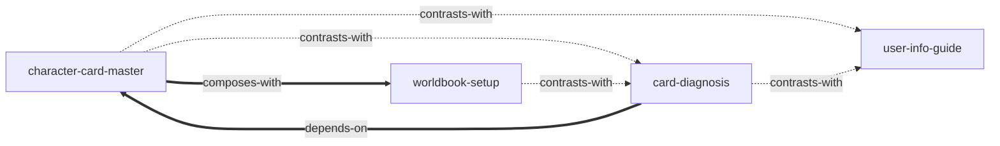

# 性格调色盘 — Skill Index

> 本书由 cangjie-skill 蒸馏, 共产出 **4** 个 skills。
> 处理时间: 2026-08-03

## 关于这本书

- **作者**: 教程作者（思想源自若葉睦/咚咚/泉此方/YQBB/祝雨晴桐等）
- **出版年**: 2025 年起随缘更新
- **一句话主旨**: 把角色从"性格标签"变成"一整套可运行的决策系统"，让 AI 不再照着标签演模板，而是在具体场景里自然长出一个活人。
- **整书理解**: 见 [BOOK_OVERVIEW.md](./BOOK_OVERVIEW.md)
- **精华长文** (不读全书看这篇): [DIGEST.md](./DIGEST.md)
- **术语词典**: [GLOSSARY.md](./GLOSSARY.md)

---

## Skill 列表 (按主题分组)

### 创作 — 让 AI 演出"活人"

- [`character-card-master`](./character-card-master/SKILL.md) — **写卡大师**：从零创建一个完整的 AI 角色卡。核心技能，覆盖认知地基/基础信息/调色盘/进阶三件套/二次解释/意象/开场白的完整流程。
- [`card-diagnosis`](./card-diagnosis/SKILL.md) — **改卡诊断**：已有角色卡演不活（标签化/很 AI/太肥/被锁死/AI 误读）时，先诊断病根再对症下药。

### 工程 — 让写好的内容被 AI 读到

- [`worldbook-setup`](./worldbook-setup/SKILL.md) — **世界书配置**：内容写好了但 AI 没读到/读不全/读乱时，配置触发/位置/顺序/递归/关键词。

### 用户侧 — 让 AI 正确理解用户

- [`user-info-guide`](./user-info-guide/SKILL.md) — **用户信息**：AI 误解用户动作（把揉脸颊当占有/把沉默当冷暴力）时，写用户信息校准 AI 的行为归因。

---

## 引用图



图例:
- `-->`  depends-on
- `-.->` contrasts-with
- `===>` composes-with

关系说明:
- **card-diagnosis depends-on character-card-master** — 诊断出的病根，药方全部指向写卡大师的具体步骤。
- **worldbook-setup depends-on character-card-master** — 配置的是写卡大师产出的内容。
- **character-card-master composes-with worldbook-setup / user-info-guide** — 写完卡可顺带部署进世界书、产出用户信息。
- **card-diagnosis / user-info-guide 与 character-card-master contrasts-with** — 修复 vs 创建、用户 vs 角色，入口不同。

---

## 推荐学习顺序

(从依赖图的叶子节点开始, 向上)

1. **character-card-master** — 核心，没有前置，一切的起点。先学会怎么写。
2. **card-diagnosis** — 依赖写卡大师。会写之后才能诊断"哪里写坏了"。
3. **worldbook-setup** — 依赖写卡大师。写完卡之后把内容部署进世界书。
4. **user-info-guide** — 独立。在游玩时遇到"AI 误解我"再学，或写卡时顺带产出。

---

## 安装使用

本目录是构建产物, 宿主不会从这里加载 skill。要让 agent 真正调用, 把 skill 目录复制到宿主的 skills 目录:

```bash
# 用户级 (所有项目可用)
cp -r character-card-master ~/.claude/skills/
cp -r card-diagnosis ~/.claude/skills/
cp -r worldbook-setup ~/.claude/skills/
cp -r user-info-guide ~/.claude/skills/

# 或项目级
cp -r character-card-master <project>/.claude/skills/    # Claude Code
cp -r character-card-master <project>/.cursor/skills/    # Cursor
```

---

## 接入 darwin-skill

所有 skill 均带有 `test-prompts.json` (darwin-skill 兼容格式), 可直接接入自动进化:

```
darwin evolve books/character-palette/
```

---

## 审计轨迹

- 候选单元池: [candidates/](./candidates/)
- 被淘汰的候选 (含原因): [rejected/](./rejected/)
- BOOK_OVERVIEW: [BOOK_OVERVIEW.md](./BOOK_OVERVIEW.md)
