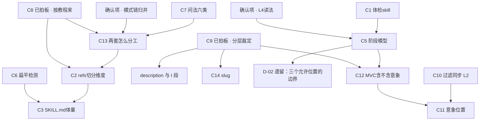

# 04 冲突拍板单

> **11 个待拍板的冲突 + 2 个待确认项**（原 12 条，C8 已拍板关闭 → `09_拍板记录.md` D-01）。"我的建议"是建议，不是决定。
> 分级：`L0` 命名（改个名就解决）/ `L1` 结构（影响文件怎么切、流程怎么排）/ `L2` 行为契约（影响 AI 在对话里能做什么）/ `L3` 哲学（触及"教程≠skill"最高约束）。
> **建议的拍板顺序在文末 §依赖图**——有几条互为前提，顺序错了会返工。
>
> ⚠️ **本文件经过两轮修正**：
> ① 独立证伪复核（`07_证伪复核报告.md`）——原列 14 条冲突，**C4 / C8 降为确认项、C13 重写**（线 B 的对应内容在 `design/` 审查报告里而不在主文档），**C9 的教程证据被方向性修正**。
> ② C08 教程侧专题查证（`08_专题_行为背后的原因.md`）——**C8 升级回真冲突并已拍板关闭**（`09_拍板记录.md` D-01）。

---

## 冲突总览

| 编号 | 级别 | 议题域 | 一句话 | 三线是否都有主张 |
|---|---|---|---|---|
| ~~**C8**~~ | ~~L2~~ | D06 | ✅ **已拍板：按教程来**（撤回心理学框架，落地教程自己的四条机制）→ 决策记录见 `09_拍板记录.md` D-01 | 已关闭 |
| ~~**C9**~~ | ~~L3~~ | D07 | ✅ **已拍板：分层裁定**（追问零术语 / 告知限三个位置 / 不另造产物名）→ 决策记录见 `09_拍板记录.md` D-02 | 已关闭 |
| **C10** | **L2** | D08 | 过滤掉一条素材，要不要同步告知用户 | A 对 B |
| C2 | L1 | D02 | references 按构件切还是按追问动作切 | A/B 对 C |
| C3 | L1 | D02 | SKILL.md 体量 ~100 / ~150-180 / ~250-300 | 三线都有 |
| C5 | L1 | D03 | 阶段模型用三阶段还是六阶段 | B 对 C |
| C6 | L1 | D04 | 扁平检测教程无直接判据，保留吗 | 仅 C 有 |
| C7 | L1 | D05 | 问法六类这一层保留吗 | 仅 A 有 |
| C11 | L1 | D08+D10 | 意象在人物文档里排第一还是最后 | A 对 B+教程 |
| C12 | L1 | D09 | MVC 结构兜底含不含意象 | A 对教程 |
| C13 | L1 | D11 | 线 B 内部两套卡住机制怎么分工（**已重写**） | A=B①，B② 另一层 |
| C1 | L1 | D01 | 角色验证/体检 skill 要不要纳入路线图 | 仅 C 有 |
| **C14** | **L0** | D12 | 最终 slug | 三线各不同 |

**降为确认项的 2 条**（不再是冲突，只需你点头。原有 3 条，其中 C8 已因教程侧专题查证**升级回真冲突**）：

| 原编号 | 议题域 | 确认什么 | 为什么不再是冲突 |
|---|---|---|---|
| ~~C4~~ | D03 | 确认"L4 只否决**文档框架排列**，构建路径多入口、推演优先级采纳线 A 的螺旋模型"这个读法 | `CBGD §12.8 L4` **依据第 3 条已自答**："混淆了构建路径（多入口）和文档框架（固定结构）……文档框架只有一个，按依赖链排最稳定" |
| ~~C8~~ | D06 | ⚠️ **已升级回真冲突，见 `08_专题_行为背后的原因.md`**。两线一致**不构成证据**——这套方法源自同一个未读教程时的构想，不是从教程蒸馏出来的。教程侧查证结论：心理学框架**零使用 + 明文禁令**，构想的产出物形态被**逐字列为错误示范** | 原判"两线一致只需确认"**已撤回** |
| ~~C13 的一半~~ | D11 | 确认线 A 三层模式与线 B `E_SECTION 决策 6` 是同一条链，直接归并 | 两者同名、切换判据措辞几乎逐字，且线 B 把它列为 body 必备 |

---

## ✅ C9：术语对用户零暴露，还是双名并行 · L3 · D07 —— **已拍板：分层裁定**

> **决策记录见 `09_拍板记录.md` 决策 [D-02]**（含五问、被否决方案、代价、影响面、遗留待办）。
> **结论一句话**：追问过程零术语；阶段性告知允许构件名，但只限三个位置（MVC 暂停告知 / 阶段收束告知 / 人物文档小节标题）；诊断词永远不对用户说；**不另造产物名**——告知时用的就是方法名本身。
> **落地**：红线 `04` H-06（术语三级制）/ H-27（两层分离升级为红线）/ H-10（边界改写为"不解释原理 ≠ 不能出现词"）。
>
> ⚠️ **拍板采纳的不是下方选项 3 的原文。** 原选项 3 写的是"阶段性告知允许**产物名**"（另造一套用户友好的名字）；实际呈现给用户、并被采纳的是**直接用方法名、不另造产物名**的简化版。差别与理由见 `09` D-02 §"与 `04` 原选项 3 的差别"。**`DISCUSSION_01 议题 6`（产物名要不要设）随之关闭：不设。**
>
> **连带消解**：线 B 张力 `T20`（MVC 告知泄漏了三个术语）不再是泄漏，是 D-02 允许的行为。

**以下是原冲突陈述与选项的完整记录，保留供参考**：

**冲突陈述**：线 A 要求面向用户的输出使用"产物名 + 首次带括号方法名"（方法名对用户可见）；线 B/C 要求方法论术语对用户完全不出现。二者在"AI 说出口的那句话里能不能出现'调色盘''多面性'"上直接互斥。

**线 A 主张**：双名并行。面向用户输出用产物名 + 首次带括号方法名；内部文档（SKILL.md、references）直接用方法名；人物文档标题产物名为主。（锚 `HANDOFF §2.17`、`REVISION §1.3`、`REVISION §四`）
新增的独特理由：**产物名是隐喻失效时的 fallback**——"'调色盘'这个隐喻在某些模型上可能失效"，并要求 AI"如果用户反馈角色表现不对，先检查是不是模型没理解隐喻"。

**线 B 主张**：I 段不出现术语（三方一致），I 段用执行语言不用教学语言（"追问用户哪个特质是一直在的"，不是"底色是无论什么场景都隐隐存在的东西"），术语放 E 段作 AI 内部标签。（锚 `CBGD §1.3`、`§七 原 #2`）
**但线 B 自己漏了**：MVC 告知原话出现"多面性/混色/核心人格层"三个术语（本线张力 B/T20，锚 `CBGD §4.3`）。

**线 C 主张**：最彻底的零术语。每个 probe 强制"AI 内部诊断 / AI 对用户的外部问法"两层分离，四个诊断词永远不对用户说。（锚 `ARCHITECTURE_DECISION.md §references 的职责`、`DIAGNOSTICS_DECISION.md §追问的核心纪律`）

**教程证据** ⚠️ **本条经证伪复核方向性修正**（`07` 修正 4）。原表述"教程未涉及此议题，谁都不能声称教程支持"**已撤回**：

教程正文确实没有**讨论**过这个议题，但**唯一一份写给 AI 执行的规范用示范给出了答案**——`工作流/角色理解24-80-200问AI循环问答工作流.md` 里术语不但对用户出现，还由 AI 主动定义：

```
110| Q24_05：她的底色是什么？
111| 解释：底色是无论场景怎么变都隐隐存在的质地。
116| Q24_07：她的点缀色是什么？
117| 解释：点缀色负责反差和隐藏层。
119| Q24_08：哪两种颜色最容易撞在一起？
120| 解释：这是混色的入口。
```

产出模板以术语作小节标题（`:256`"## 三、调色盘线索"、`:266`"## 五、核心人格层线索"、`:276`、`:295`），"下一步建议"的选项名是"先写调色盘。先写核心人格层。先写混色画面。先写二次解释。"（`:314-319`）。`80问教程.md:218/229/240` 题面同此。

**因此**：**"全程零术语"在教程里没有原型；"方法名可对用户出现"有直接原型**，而且是最强的那种原型（写给 AI 执行的规范）。

**⚠️ 但这不构成对任一方案的裁定**：执行器是**逐题问答**形态（AI 报题号、给解释、用户答），与三线设计的**追问式对话**形态不同——逐题问答里术语是题目的一部分，追问式对话里术语是可以绕开的。这条证据能做的是把**举证责任交还给主张"全程零术语"的一方**。

**AGENTS.md 约束判定**：**不能直接裁定这一条。** AGENTS.md 说的是"skill 不对用户解释方法论**原理**（除非用户主动问）"——"不解释原理" ≠ "不能出现词"。它禁的是"这就是调色盘。底色、主色调、点缀"这种**教学式引入**，没禁"我们已经聊清楚她的多面性了"这种**指代式使用**。

**选项**：

- **选项 1 · 全程零术语（线 B/C）**
  代价：MVC 告知和收束时"告诉用户还能往哪走"会变得啰嗦或含糊——线 B 的 T20 就是这个代价的实证，它不得不泄漏了三个术语。产物名不用定，`DISCUSSION_01 议题 6` 自动关闭。
- **选项 2 · 双名并行（线 A）**
  代价：用户第一次看到"情感混色（混色）"这种写法会产生"我是不是该学点什么"的压力，与"用户不需要学习教程"的定位有张力。且必须先定一套产物名（线 A 本线未决）。
- **选项 3 · 分层裁定（折中）**
  **追问过程零术语**（线 C 的两层分离全盘采纳）+ **阶段性告知允许产物名**（MVC 暂停、收束、人物文档标题这三处用产物名，方法名只在用户主动问"这是什么"时才给）。
  代价：需要定产物名，但只需定用到的那几个（多面性/混色/核心人格层）；规则比选项 1 复杂一层。

**我的建议**：**选项 3**，且复核后我对它更有信心。三条理由：① 选项 1 有实证反例——线 B 自己在唯一必须告知的地方（MVC 告知）破了功；② 选项 1 在教程里**没有原型**，而教程唯一写给 AI 的规范恰恰是术语可见的；③ 选项 2 把 fallback 需求扩大到了全流程，而线 A 的 fallback 理由只在"用户反馈角色表现不对"时才被调用——那正好是用户主动发问的场景。选项 3 精确对应"追问时不需要名字，告知时需要名字"这个真实分界。

**拍板补充的证据**（`SKILL交接包/素材/题库.md` §I，提取于拍板前）：正向 **76 条**逐字带锚，反向 **0 条**（附 22 词检索表）。其中最强的一条是原分析没抓到的——**执行器拿术语当选项去问用户卡在哪**：`工作流.md:210`「否则你应该先问用户卡在哪一块。」而可选卡点里以术语命名的有 8 条（不知道调色盘 / 不知道核心恐惧 / 不知道三面性 / 不知道混色……）。另需注意：项目里确实存在"不用术语"的表述，但**全在 `_AI_READ_THIS_FIRST.md` 和 `books/char-palette/` 这些我们自己的翻译层文件里**，不是教程原文，不能当证据引。

**影响面**：~~定 C9 才能定~~ → **已定，以下全部解锁**：产物名要不要设（`DISCUSSION_01 议题 6` → **不设**）、MVC 告知语（C12 解除依赖）、I 段草稿能否直接采用（线 B `§八` 产物 1 的 🔴 → 解除，但草稿要按"追问侧零术语"复核）、probe 外部问法的措辞规范（→ `03` 通用规格已写死）、`CBGD` T20（→ 张力消解）、C14 slug 与 description 措辞（解除依赖）、`素材/案例原文.md`（解除 C9 依赖，仍卡"案例选哪几个"）。

---

## ✅ C8：心理学框架 · L2 · D06 —— **已拍板：按教程来**

> **决策记录见 `09_拍板记录.md` 决策 [D-01]**（含五问、被否决方案、代价、影响面、遗留待办）。
> **结论一句话**：撤回 4 个心理学框架 + 8 个扩展池框架，改为落地教程自己的四条机制——① 卡住时抽该部件的行为题；② 产出物强制写成"条件-动作"运行规则；③ AI 反推走"高可能推论"区块 + 四条围栏；④ 作者始终说不出核心矛盾就跳过这一层。
> **保留**：问题诊断（用户能看见行为说不出原因）、反推方向（从已有行为反推）、频率偏差分析（作为诊断，不作为生成轴）。

> **改判轨迹**（三条铁律要求被取代的决策不删除）：
> 1. 初判：L2 冲突（"线 A 独有的外挂"）
> 2. 证伪复核后：降为确认项（线 B `KNOT_BODY_VS_REFS.md` 也有，落位方案逐条重合）
> 3. 教程侧专题查证后：升级回真冲突——"两条线都提到"**不构成证据**，因为这套方法源自同一个未读教程时的构想
> 4. **用户拍板：按教程来** → 关闭

**教程侧查证结论**（5 个 agent 独立覆盖全部教程，逐条见 `08` 与 `_work/Q1`～`Q5`）：

| 构想的组成部分 | 教程的态度 |
|---|---|
| 用户说不出行为背后的原因是真实现象 | ✅ 同意，专门写了核心人格层 + 教程 11 整条替代路径 |
| 从已有行为反推 | ✅ 同意，"反推"是教程原词（`7.md:318`、`:563`） |
| **靠心理学框架反推** | ❌ **零命中 + 明文禁令**：`7.md:299`「不要拿一套新理论把原角色重写成另一个人」 |
| **产出"什么经历/心理导致他这样"** | ❌ **逐字列为错误示范**：`7.md:472`、`7.md:92`「这只是素材，还不是运行逻辑」、`11.md:212-220` |
| **由 AI 产出答案** | ⚠️ 允许，但 `工作流:299-305` 要求标为"高可能推论 / 只能写推论不能写成事实"回到用户 |
| **有了深层原因 AI 演得更真实** | ⚠️ 收益被换成"跨情境不演错"；核心人格层在教程的活人感归因清单里排**第 7** |
| 用户说不出就必须解决 | ❌ **反对**：`05:62` 把"作者自己还没想明白核心矛盾的角色"列进**不适合写这一层**的排除清单 |

**已按方案 4 拍板（撤回框架，落地教程自己的机制）。四个方案的完整对比见 `08` §十一，否决理由见 `09` D-01 的"不要怎样做"。**

---

**以下是证伪复核阶段的记录，保留供参考**：

线 B 也有这套框架（原判"线 A 独有"不成立）：

**线 B 也有，且方案与线 A 逐条重合**：

> `books/xingge-tiaosepan/design/KNOT_BODY_VS_REFS.md`
> "**多框架推演的框架清单和选择规则：** 4个核心框架（依恋理论/防御机制/社会学习/认知图式）+扩展池。AI 在进入推演阶段时去查——选择哪2个框架、每个框架推演什么。**body 里需要内化的是"推演时必须用≥2个框架"这条规则，具体框架清单放 references。**"

这与线 A `REVISION §1.4`（SKILL.md 只写"从 ≥2 个不同的角度推演"，完整清单进 `references/palette.md`）**逐条重合**。线 B `B_SEGMENT_AGENT_INSIGHTS.md` 还独立得出了同一条兜底原则："推演主引擎是'从用户素材里抓重复出现的模式'，**框架是后备而非首选**"——与线 A `HANDOFF §2.11` 同义。

**成因**：原盘点把线 B `design/` 下 6 份审查报告当作"历史输入，按需回查"，只读了主文档。

⚠️ 这一段的推论"两线一致 → 只需确认"**已被 `08` 推翻**：两条线的这套方法同源于一个未读教程时的构想，一致性不构成独立证据。

**以下是原冲突陈述的完整论证记录，保留供参考**：

**线 A 主张**：`HANDOFF §2.11`。核心论证链：

**线 A 主张**：`HANDOFF §2.11`。核心论证链：
1. "反直觉"概念被废掉，真正的问题叫**频率偏差**——AI 生成时天然偏向语料中高频共现的关联（"被抛弃"→"缺乏安全感、敏感多疑"）
2. 不能靠"列出所有可能性"——纯清单会被频率偏差和锚定效应双重杀死
3. 解法：**从 ≥2 个不同心理学框架各推演一条**，"推演的多样性不靠 AI 灵机一动，靠从不同生成轴各推一条"
4. 框架筛选标准：生成性 / 行为落地 / 结构性差异 / 领域覆盖 / 卡片映射；排除特质论（描述性非生成性）、进化心理学（讲共性）、TA（与认知图式重叠）
5. 硬规则：推演禁止出形容词只许出行为场景；每条标注三要素（行为场景 / 心理机制 / **从哪段经历推出来的**）
6. `REVISION §1.4` 收窄：SKILL.md 不列框架清单只写"从 ≥2 个不同的角度推演"，完整清单进 `references/palette.md`，框架名不向用户暴露
7. `HANDOFF §2.11` 补充：**推演的主引擎是从用户素材里抓出重复出现的模式——框架是后备**

**线 B 主张**：**有**（见上），且落位方案与线 A 逐条重合。
**线 C 主张**：未覆盖。

**教程证据**：**教程完全没有心理学框架**。这是纯粹的教程外引入。教程对"多样性"的处理是让作者自己想（`02:57`"衍生本身必须你自己想"）。

**AGENTS.md 约束判定**：不直接裁定。但值得注意 AGENTS.md 的定位是"把这套教程蒸馏成 skill"——引入教程之外的方法论体系，**已经超出了蒸馏的范围**，属于增强。这不必然是错的，但应当被明确标记为"我们的增补，不是教程的"。

**影响面**：这条不再阻塞 C13；仍连带 `references/` 是否多一个文件（C2/C3）。

---

## C10：过滤掉一条素材，要不要同步告知用户 · L2 · D08

**冲突陈述**：用户说了一条 AI 判定"没有推演价值"的信息（如"她喜欢听音乐"），AI 决定不记进人物文档。线 A 要求**必须告诉用户**"这个我先不记"；线 B 要求**静默处理不打断**。二者互斥。

**线 A 主张**：`HANDOFF §2.15b`。核心区分"**确认 = 用户点头 AI 才做；同步 = 用户知道发生了什么即可**"。纯过滤：不需要确认，**必须同步**。两条理由：
1. "纯过滤不同步会引发信任问题"——"用户下次看文档发现漏了，会怀疑'AI 是不是出 bug 了？我上次明明说了'。信任直接崩掉"
2. 同步常常钓出隐藏素材——"这个没有推演价值，我先不记"→ 用户可能回"不不不，她喜欢听音乐是因为那是她爸唯一留给她的东西"

**线 B 主张**：`CBGD §12.8 决策 L10` + `L6`。"**素材静默，构件投影**"——素材记录是轮后静默的 AI 内部动作，不展示、不打断、不让用户等；只有构建区构件才用自然语言投影给用户确认。判据："素材不是结论不需要确认，构件是已提炼的结论才需要确认。"

**线 C 主张**：未覆盖。

**教程证据** ⚠️ 已按证伪复核修正（`07` F-05）。原表述"教程是人自己写卡，不存在 AI 代记"**被证伪**——教程唯一的 AI 代记规范就是执行器，而且规格相当细：

```
56| 2. 每次用户回答后，先记录本题答案，再进入下一题。
70| 每次记录答案时，使用这个格式：
72| <对应标签>
73| 问题：
74| 用户原回答：
75| 整理后的思路：
76| 可落到行为的部分：
77| 仍待确认：
78| </对应标签>
```

注意它**强制把"用户原回答"与"整理后的思路"分栏**——这与线 B `L6` 的"原话锚 + 最小加工"是同一个设计。

**但它是全记、无过滤机制**，所以对"过滤掉一条素材要不要同步"这一格**仍无直接依据**。

**AGENTS.md 约束判定**：不直接裁定。但"核心目标始终是帮用户完成角色创作"这条略偏向线 B——每条过滤都同步会显著增加交互噪音。

**选项**：

- **选项 1 · 全部静默（线 B）**
  代价：线 A 指出的两个风险都真实存在。尤其第二条——"她只在自己一个人的时候吃草莓"这类只差一个情境限制就变成好素材的东西，静默过滤掉就永远丢了。
- **选项 2 · 全部同步（线 A）**
  代价：交互噪音大。用户每说三句就被回一句"这条我不记"，追问节奏被打断。
- **选项 3 · 按过滤类型分档**
  **丢弃型过滤**（判定为永久无价值，如纯审美形容词）→ 静默；**降级型过滤**（判定为"现在没价值，但加个情境限制就有"）→ 同步一句并顺势追问那个情境。
  代价：需要在 `§12.5 推演价值判据` 上再加一层"这条是丢弃还是降级"的判断。
- **选项 4 · 静默 + 可见**
  全部静默不打断，但人物文档里给一个"**未采纳**"折叠区，用户想看随时能看。
  代价：与线 B 的 L12（否决追问日志折叠区）方向相反，且索引头 20 行的约束下这个区谁来维护。

**我的建议**：**选项 3**。理由：线 A 的第二条理由（钓出隐藏素材）其实不是"同步"的功劳，是"**追问那个情境**"的功劳——`HANDOFF §2.3c` 自己给的例子就是"'她喜欢吃草莓'价值低，但'她只在自己一个人的时候吃草莓'就是一个行为切片"。所以真正该做的不是通报过滤，是**对可降级的素材追一句**。这样既保住了钓素材的收益，又不产生"我不记你这条"的噪音。第一条信任风险则由选项 3 的"降级型必被追问"覆盖大部分。

**影响面**：定 C10 才能定 → `§12.5 推演价值判据` 要不要加"丢弃 vs 降级"分层、L10 的措辞、素材区要不要"未采纳"区。

---

## C2：references 按构件切还是按追问动作切 · L1 · D02

**冲突陈述**：线 A/B 按**方法论构件**切（调色盘/多面性/混色/核心人格层/二次解释/意象），线 C 按**追问动作**切（标签压缩/为什么/世界观/面/瞬间/核心/NSFW/误读/意象）。两套清单只有 3 个直接对应，各有对方完全没有的文件。

**线 A 主张**：6 个（`REVISION §四`）或 8 个（`HANDOFF §4`）——**本线内就打架**（张力 A/T-01），须先自裁。
**线 B 主张**：11 个（`CBGD §5.1.3`），按构件 5 个 + 流程工具 6 个（route-logic / case-library / question-bank / common-mistakes / user-confirm-signals / quick-path-guide）。
**线 C 主张**：9 个 `probe-*.md`（`ARCHITECTURE_DECISION.md §最终架构`），每个统一三段式（内部诊断 / 外部问法 2-4 个 / 质量门），并给了每个文件的行数量级、对话轮数、加载时机、轻重标注。

**教程证据**：**教程未直接涉及**。唯一间接可类比的是 C 类世界观的四层拆分（常驻 vs 按需加载，`0.md:415-426`），但那是世界书条目加载策略，只能当类比。

**AGENTS.md 约束判定**：不直接裁定。

**选项**：

- **选项 1 · 按构件切（线 B 的 11 个）**
  代价：丢掉线 C 的 `probe-tag-compress` / `probe-why` / `probe-world` / `probe-nsfw` 四个动作的独立承载——它们会被压进 `palette-guide` 或消失。丢掉线 C 的"每个文件配对话轮数和轻重标注"（`probe-faces`/`probe-core` 是 8-15 轮的重模式，其余是 1-6 轮，这个信息对 AI 判断"要不要进这一层"很有用）。
- **选项 2 · 按动作切（线 C 的 9 个）**
  代价：丢掉线 B 的 6 个流程工具文件。`case-library` / `question-bank` / `common-mistakes` / `quick-path-guide` 都没有对应的"追问动作"，无处安放。
- **选项 3 · 二维共存**（body + 构件手册 + 动作手册 + 流程工具）
  代价：文件数到 15-18 个；"调色盘"这一块会同时存在于 `palette-guide`（构件规格）和 `probe-tag-compress`/`probe-why`（追问动作）里，需要明确"规格在哪、话术在哪"的分工规则，否则重复。
- **选项 4 · 单维 + 三段式**：保留线 B 的构件切分，但**每个文件内部采用线 C 的三段式结构**（内部诊断 / 外部问法 / 质量门），并把线 C 独有的四个动作作为对应构件文件里的小节。
  代价：`palette-guide` 会变厚（吞下 tag-compress + why）；`probe-world` / `probe-nsfw` 需要找归宿（world 可能属 `worldbook-config` skill 或入口环节，nsfw 无处可去）。

**我的建议**：**选项 4**。理由：线 C 最有价值的资产不是"按动作切文件"这个形式，而是**三段式内部结构**和**内部诊断/外部问法强制分离**这条原则——这两样可以脱离文件切分方式独立采纳。而线 B 的 6 个流程工具文件确实无法映射到动作。选项 3 的重复风险和文件膨胀代价偏高。

**影响面**：定 C2 才能定 → C3（SKILL.md 体量）、G-1 缺口（4 诊断的外部问法放哪）、`probe-nsfw` 的归宿。
（原列的"C8 的框架清单放哪"已消失——C8 拍板撤回框架，`derivation-frameworks.md` 不建，见 `09` D-01。）

---

## C3：SKILL.md 体量 · L1 · D02

**冲突陈述**：~100 行（线 B）/ ~150-180 行（线 C）/ ~250-300 行（线 A），差 3 倍。这不是行数问题——**它取决于 4 个基础诊断的判定树进不进 body**。

**线 A 主张**：~250-300 行，六段（红线 / 角色定义 / 入口引导 / 决策树 / 交互原则 / 禁止事项）。`REVISION §1.1` 的论证是从 2000+ 行压下来的，核心理由是"context window is a public good"、"教程里的解释和论证是给人建立心智模型用的，AI 不需要"。
**线 B 主张**：~100 行（80-120），8 项必备内容 + 分界测试。分界测试（`CBGD §5.1.1`）："如果把这条从 body 拿掉，AI 是在每一轮都可能犯同一个错，还是只在某个阶段可能犯某个错？前者必须在 body。"
**线 C 主张**：~150-180 行，装 4 个基础诊断 + 信号路由 + 流程管控。理由（`ARCHITECTURE_DECISION.md`）："这 4 个诊断全程运行，每轮都要用。如果放 reference，等于一个'永远要加载'的 reference，那文件边界没有提供任何信息。"

**关键观察**：线 C 的理由**恰好就是线 B 分界测试的结论**——4 诊断是"每一轮都可能犯同一个错"，按线 B 自己的测试就该在 body。**但线 B 的 body 8 项清单里没有它们。** 而线 C 自己也承认体量没核对过（本线张力 C/T-20："SKILL.md 预算 150-180 行与'每个诊断写完整判定树+正反例+两张清单内联'的规格没做过体量核对"）。

**教程证据**：无。

**选项**：

- **选项 1 · ~100 行**：4 诊断只留一句话摘要在 body，判定树进 reference。代价：违反线 B 自己的分界测试；每轮都要加载那个 reference。
- **选项 2 · ~150-180 行**：4 诊断的判定树进 body，正反例进 reference。代价：需要先做体量核对（线 C 未做），判定树压缩后是否还可复现存疑。
- **选项 3 · ~250-300 行**：全进。代价：body 是常驻成本，挤占对话上下文。
- **选项 4 · 不定行数，定归属规则**：先按线 B 的分界测试逐条判归属，写完再看实际行数。代价：写作过程中无预算约束，可能失控。

**我的建议**：**选项 2 + 先做体量核对**。理由：分界测试是三线里唯一一条可操作的归属规则，它把 4 诊断判到 body；线 B 的 100 行是在不含 4 诊断的前提下估的，加上判定树后自然落到 150-180 区间。但线 C 的 C/T-20 是真问题——**建议在写 SKILL.md 前先把 4 个判定树按实际格式写出来数行数**，再回头定预算。

**影响面**：依赖 C2 的结论。定 C3 才能定 → G-1 缺口的落位。

---

## ~~C4~~ → 确认项：构建区排序 · D03

> ⚠️ **本条经证伪复核从冲突降为确认项**（`07` 修正 3）。原判"需要用户确认 L4 否决的是排版还是推演优先级"——**L4 的依据原文已经自答了**。

`CBGD §12.8 决策 L4` 的**依据第 3 条**：

> "否决 b2 的'核心人格层在前'（少数派）：**混淆了构建路径（多入口）和文档框架（固定结构）**。姜糖的构建路径（先核心驱动力）不代表文档排列要跟随构建路径——**文档框架只有一个，按依赖链排最稳定**。"

**L4 明确只否决"文档框架排列"，并明确承认"构建路径是多入口"。** 这与线 A `DISCUSSION_01 §决策 3` 的螺旋模型（层→面是 AI 内部推演优先级，不是用户交互硬约束）**完全兼容**。原分析完整引了 L4 的结论却漏了它的依据，把已答的问题写成了开放冲突。

**你需要确认的只有一件事**：接受下面这个读法——

- **文档框架排列**：按依赖链（基础信息→调色盘→**多面性→混色→核心人格层**→二次解释→意象），与最终卡一致
- **构建路径**：多入口，用户从哪进就从哪追
- **AI 内部推演优先级**：层的防御机制决定面的功能，AI 主动推演时先确认防御机制或同时推演；无论从面还是层开始，组装时跑一致性验证（线 A 螺旋模型）
- 依赖链注释里要写清"**这是文档框架顺序，不是追问顺序**"

**遗留待线 A 自裁**：线 A 有三套互斥的顺序（本线张力 A/T-19）——构建顺序（层在面前）、呈现顺序（意象第一）、蓝图顺序（**面在层前**，恰是本线明文拒绝的）。这不影响本确认项，但影响 C11。

**以下是原冲突陈述的完整论证记录，保留供参考**：

**原冲突陈述**：线 B 的 `决策 L4` 明确"构建区依赖链排序 + 依赖链注释（**否决 b2 的'核心人格层在前'**）"；线 A 的 `HANDOFF §2.6` 主张"核心人格层在多面性之前"。

**线 A 主张**：核心人格层在多面性之前。理由："多面性每张面有一个'功能'部件——而这个'保护什么'恰恰就是核心人格层的防御机制。先挖核心人格层，多面性的'功能'直接等于防御机制的分支，有依据，一次写准。"（`HANDOFF §2.6`）
**且线 A 自己已经降格了**：`DISCUSSION_01 §决策 3` 把它收窄为"AI **内部推演优先级**，不是**用户交互硬约束**"——用户先说面就顺着面追问，动机累积为层素材，层成型后校准面功能（螺旋模型）。

**线 B 主张**：构建区顺序 = 教程依赖链（基础信息→调色盘→**多面性→混色→核心人格层**→二次解释→意象），与最终角色卡呈现顺序一致。（`CBGD §12.8 决策 L4`）

**线 C 主张**：无构件级排序。

**教程证据**（`01_教程事实底册 §2.2`–`§2.4`，⚠️ 已按证伪复核修正）：
1. `07_意象篇.md:196` 的七步序列，教程在同一章给了**两种互斥定性**——`:192` 用它答"放在人设的什么位置"（排版），`:245` 又把它命名为"完整**写卡流程**回顾"（流程）。**教程从未把排版顺序与构建顺序分开说过，更从未涉及追问顺序**（大总结七章"追问"零出现）。
2. **教程无法裁定核心人格层与多面性的构建先后**——两个方向都说过且互相不一致：`7.md:178-183` 体系位置表把层排在面前，`7.md:12/14/912` 又把"会用三面性"写成进入本章的前置条件；`05:256-262` 与 `7.md:178-183` 这两份体系位置表的先后**完全相反**。
3. 核心人格层的输入依赖是调色盘 + 已写行为 + 背景，**没有任何一处说依赖三面性**（`05:266`/`05:94`/`05:55`）。
4. 反过来，核心人格层写完可以让三面性降级为运行表、删掉、甚至整层不写（`7.md:488-510`、`:700`）——**这是线 A"先挖层，面更好写"的旁证**。

**结论**：教程不能裁定构建先后，但 L4 的依据原文已经自答了这个问题（见本节开头）。

---

## C5：阶段模型用三阶段还是六阶段 · L1 · D03

**冲突陈述**：线 B 用三个职责阶段（接住→追问循环→MVC 暂停→深化/收束），线 C 用六阶段流转（入口分流→基础身份→性格质地→AI 可执行性→意象→整理输出）。粒度和切分点都不同。

**线 A 主张**：`HANDOFF §2.4` 明说"阶段/下一步概念被取消"——构建是特征驱动的迭代环。**但本线内自相矛盾**（张力 A/T-08：§2.16/§2.19b 又说"SKILL.md 阶段三"、§2.8 有线性环路图、§2.6 有步骤分级表）。须先自裁。
**线 B 主张**：`CBGD §四`。三个职责阶段，"阶段之间是路标，不是流程强制——AI 在两个路标之间自主导航"。
**线 C 主张**：`questioning-moves.md §第三部分`。六阶段 + 六条运行规则，深度分支在"性格质地"阶段内**由信号触发**，"深度不设关卡"，未检测到信号不是漏做而是"角色不需要那个层次"。

**教程证据**：教程的七步（`07:245-278`）是**排版顺序**（见 C4），不能直接当阶段模型。但教程明写了必须/条件的分界（第三/四/五步带条件标注），这与线 C 的"信号触发、不设关卡"一致。教程还明写了转出信号：`02_调色盘篇.md:370`"当调色盘的衍生已经不够描述角色在不同场景下的巨大差异时，你就需要下一个工具了"——**这是可直接用的信号判据**，线 C 的信号路由与之对应。

**选项**：

- **选项 1 · 线 B 三阶段**：代价：没有"入口分流"和"AI 可执行性"这两个环节的位置。线 C 的入口分流处理"用户带现成卡来"的情况，线 B 只在 §4.1 有一行"入口意识"。
- **选项 2 · 线 C 六阶段**：代价：没有 MVC 暂停点（线 C 完全没有 MVC 概念），"整理输出"这一步与线 B 的收束/L11 手动导出重叠但更粗。
- **选项 3 · 线 C 六阶段为骨架，插入线 B 的 MVC 暂停点**
  即：入口分流→基础身份→性格质地（内含信号触发的深度分支）→**MVC 暂停**→AI 可执行性→意象→整理输出。
  代价：需要重新确定 MVC 锚点位置（线 B 的三层判读判的是"角色活没活"，插在性格质地之后还是 AI 可执行性之后要定）。

**我的建议**：**选项 3**。理由：线 C 的六阶段与教程的构件顺序对应更紧（AI 可执行性 ≈ 二次解释，意象 ≈ 第七步），且"信号触发、深度不设关卡"有教程直接依据；线 B 的 MVC 暂停是线 C 完全空白的一块（D09 线 C 覆盖为 0），必须补进去。锚点位置建议放在"性格质地完成、AI 可执行性之前"——因为线 A 的 MVC 结构定义是"调色盘 + 二次解释"，而二次解释正是 AI 可执行性阶段的产物，MVC 若放在它之后就失去了"暂停问要不要继续深化"的意义。**但这一点与 C12 耦合，请一起看。**

**影响面**：定 C5 才能定 → MVC 锚点位置（连带 C12）、`route-logic.md` 的内容、body 的流程地图怎么写。

---

## C6：扁平检测教程无直接依据，保留吗 · L1 · D04

**冲突陈述**：线 C 的 4 个基础诊断里，泛化 / 矛盾 / 结论三个都能在教程里找到直接判据，**只有"扁平检测"（全是正面特质没有缺点/反差）在教程里没有直接判据**。线 A / 线 B 都没有这个诊断（复核确认：线 B 全库 5 处"扁平"全部无关）。

⚠️ 复核修正：不要称它为"线 C 的原创扩展"——线 C 自己的口径是 `verified.md`"V1 跨域佐证**通过**：4 个独立场景"。准确表述是：**它通过了线 C 的验证流程，但教程里找不到直接判据。**

**线 C 主张**：`DIAGNOSTICS_DECISION.md §诊断四`。三级判定：把特质分正面/真负面/伪负面 → 伪负面识别（换成正面说法读起来一样即伪）→ 真负面=0 且总特质≥3 则触发 → 可选的方向多样性检查。跨诊断优先级里排最后。
**线 A / 线 B 主张**：未覆盖。

**教程证据**：`01_教程事实底册 §四 D04` 明确记录"**教程没有给出扁平检测的直接判据**"（复核确认此全称否定成立）。间接旁证有两条：`03_三面性篇.md:263-269` 的三问否决清单（判断是否需要拆面）、以及全套教程反复强调的"反差"（点缀色的定义就是"负责反差、隐藏层、惊喜感"，`02:33-37`）。

**AGENTS.md 约束判定**：AGENTS.md 定位是"把教程蒸馏成 skill"。**引入教程里没有直接判据的诊断，与心理学框架同属"增补"性质**，应当被显式标记。

**选项**：

- **选项 1 · 保留为完整诊断**：代价：它是四诊断里唯一无教程根的，且线 C 自己就有两条内部张力（C/T-06"优点有副作用算打破扁平"与"伪负面计入正面"互斥；C/T-14 长短版阈值不等价）。
- **选项 2 · 降级为观察项**：不触发追问，只在 MVC 判读时作为"角色是否立体"的参考。代价：失去了一个真实有用的早期信号——"5 个优点 0 个缺点"确实是常见问题。
- **选项 3 · 移除**：代价：丢掉一个真问题的检测。
- **选项 4 · 保留但改挂在点缀色上**：把它从"扁平检测"重命名为"点缀缺失检测"，判据改为"调色盘里有没有一个负责反差的颜色"——这样它就有教程根了（`02:33-37` 点缀色定义 + `02:137`"她在什么时候会和平时表现得完全不同"）。
  代价：适用范围收窄到调色盘已成型之后，早期标签阶段用不上。

**我的建议**：**选项 1，但标注为增补**，并要求线 C 先自裁 C/T-06 和 C/T-14。理由：选项 4 很优雅但把检测时机推得太晚——扁平最该被发现的时刻恰恰是用户刚甩过来一堆标签的时候。这个诊断解决的是真问题（AI 数据库里的"完美角色"是最强的高频关联），代价只是"它是我们加的"，明确标注即可。

**影响面**：小。定 C6 才能定 → 跨诊断优先级表是 4 项还是 3 项、body 里 4 诊断的篇幅（连带 C3）。

---

## C7：问法六类这一层保留吗 · L1 · D05

**冲突陈述**：线 A 有"问法六类"（按"问什么维度"切）+ 问题目标层；线 C 有"13 个追问动作"（按"诊断到什么问题就用哪个"切）。两套是不同切法。线 A 的六类**本线内连放哪个文件都有三个答案**（张力 A/T-05），且没有一个动作的完整定义。

**线 A 主张**：六类保留，但 `DISCUSSION_01 §决策 2` **废除了"按可答性排序"**，改为"按用户的**卡壳类型**选择对应问题类别"，并加了元规则"当 AI 不确定该用哪类问题时，先再听一轮"。另有 §2.16 问题目标层（"问的目标是什么、问到什么程度算够"，源头是教程 80 问十组目标）。
**线 B 主张**：追问深度轴（标签→画面→矛盾→为什么→内核）+ 每层 1-2 个标志性问法作措辞样本，明确"不是穷举范例库"。
**线 C 主张**：13 个追问动作，每个含内部诊断 / 外部问法 / 质量门三要素。

**教程证据**：**80 问十组的目标声明**（`01_教程事实底册 §四 D05` 全表）是"问到什么程度算够"的唯一教程依据，它按**主题域**分组（角色核心 / 调色盘 / 背景来源 / 欲望缺失恐惧 / 防御决策 / 关系 / 三面性 / 混色 / 台词行为 / 底线弧光二次解释）——**既不是线 A 的六类，也不是线 C 的 13 动作**，而是第三种切法。

**选项**：

- **选项 1 · 只留 13 动作，砍掉六类**：代价：丢掉"按卡壳类型匹配"这个选择器。但线 B 的 G6 四级阶梯 + 线 C 的诊断触发已经覆盖了大部分选择场景。
- **选项 2 · 三层并存**：深度轴（默认方向盘）+ 13 动作（诊断触发的动作库）+ 六类（卡住时的选择器）。代价：三套并存，AI 需要知道什么时候查哪套。
- **选项 3 · 六类并进 13 动作**：把六类的"卡壳类型→问题类别"映射写进 `route-logic` 或卡住处理的阶梯里，不单独成层。代价：六类的完整定义（每类定义 + 例句 + 匹配的卡壳特征）从未被写出来过，并进去等于要现写。

**我的建议**：**选项 3**。理由：六类在线 A 里始终是个未完成品（没有完整定义、位置三方不一），它真正有价值的是"**按卡壳类型匹配，而不是按顺序遍历**"这条元规则和"不确定就先再听一轮"这条兜底——这两条可以直接并进卡住处理（C13），不需要撑起独立的一层。同时**建议把教程 80 问十组的目标声明落成 `question-bank.md` 的分组结构**——那是有教程根的第三种切法，比六类更实。

**影响面**：定 C7 才能定 → `question-bank.md` 的组织方式、C13 卡住阶梯的内容。

---

## C11：意象在人物文档里排第一还是最后 · L1 · D08+D10

**冲突陈述**：线 A 的呈现顺序把**意象放第一**（"呈现上第一个被读到，锚定读文档者对人物整体的感觉；构建上最后一个被创造"）；线 B 的构建区把**意象放最后**；教程明写意象放最后。

**线 A 主张**：`HANDOFF §2.5`。呈现顺序 = 意象 → 素材区 → 调色盘 → 核心人格层 → 多面性 → 混色 → 二次解释。
**线 B 主张**：`CBGD §12.8 决策 L2/L4`。索引头 → 素材区 → 构建区（基础信息→调色盘→多面性→混色→核心人格层→二次解释→**意象**）→ 归档区。
**线 C 主张**：无构件级排序，但阶段流转里意象在"整理输出"之前的倒数第二环。

**教程证据** ⚠️ **原判"很明确"已撤回**（素材提取第二轮发现，见 `99_过程日志.md` Phase 10）。

支持意象放最后：
- `07_意象篇.md:192`"放在最后面。在二次解释之后。"
- `07_意象篇.md:196` 完整顺序"基础信息 → 调色盘 → 三面性 → 混色画面 → 核心人格层 → 二次解释 → 意象"
- `07_意象篇.md:214`"放在人设的最后面。是AI读到的最后一样东西，**记忆残留最强**。"
- `07_意象篇.md:274` 流程回顾第七步"放在最后面"
- 教程 11 的平替路径同样把意象放人设最后（`11.md:467`）

⚠️ **但二次解释篇主张的是它自己放最后，且用的是同一个论证**：
- `06_二次解释篇.md:162`"放在调色盘、三面性、混色画面、核心人格层后面。**它是最后一层防护**。"
- `06_二次解释篇.md:166` 完整顺序"基础信息 → 调色盘 → 三面性 → 混色画面 → 核心人格层 → 二次解释"——**这张顺序表里根本没有意象**
- `06_二次解释篇.md:170`"你把二次解释放在最后，AI 最后读到的东西会在它开始写正文时有更强的'**记忆残留**'。最后读到的备注，效果最强。"

**两章各自宣称自己是最后一项，且用的是逐字同构的"记忆残留最强"论证。**

**这改变了什么**：原分析把"意象放最后"当作教程的明确裁定，据此把线 A 的"意象放第一"当成与教程对立的一方。实际上**教程在"谁放最后"这件事上自相矛盾**——"记忆残留最强"是一条**位置论证**，教程把它同时授予了两个构件，说明它论证的其实是"**最后一项占便宜**"这个通则，而不是"**必须是意象**"。

**所以本条的教程权重要下调**：教程能支持的只有"意象在二次解释之后"（`07:192` 明说了相对位置，这一条两章不冲突），支持不了"意象必须是整份文档的末位"。线 A"意象放第一"仍与 `07:192` 冲突，但冲突强度比原判弱。

**关键区分（这一条决定了它是不是真冲突）**：**教程说的是给扮演 AI 读的角色卡，线 A 说的是给人读的人物文档。** 两者读者不同、目的不同——教程的理由是"AI 记忆残留最强"，线 A 的理由是"锚定读文档者对人物整体的感觉"。线 B 的 `L11` 已经把两者分开了（最终卡由用户手动触发导出，构建区按依赖链组装）。

**选项**：

- **选项 1 · 两份文档分开定序**：**人物文档**（协作过程用）意象在前（线 A）；**最终卡**（导出给扮演 AI）意象在后（教程 + 线 B）。
  代价：导出时需要做一次重排，L11 的导出逻辑要写清"构建区按依赖链组装，但意象移到末尾"。
- **选项 2 · 统一放最后**：代价：丢掉线 A 的锚定收益。但注意线 B 的**索引头**已经承担了"一眼看到这个角色是什么"的功能，锚定需求可能已被满足。
- **选项 3 · 统一放最后 + 索引头带意象一行**：意象在构建区末尾，同时索引头里放一行意象摘要。
  代价：索引头 20 行的预算再挤一行。

**我的建议**：**选项 3**。理由：线 A 的诉求（读文档的人一眼被锚定）是真实的，但它不必靠"把整节意象搬到最前"来实现——线 B 的索引头就是为这个需求设计的，加一行意象摘要即可，代价远小于维护两套顺序。同时构建区与最终卡顺序一致，L11 的导出逻辑不用做重排，接手者也不会看混。

**影响面**：定 C11 才能定 → L2/L4 的排序表述、L8 索引头的字段清单、L11 导出逻辑。

---

## C12：MVC 结构兜底含不含意象 · L1 · D09

**冲突陈述**：线 A 明确把意象**移出** MVC（MVC = 调色盘 + 二次解释）；但教程字面上意象是**无条件项**（流程回顾第七步不带条件标注，对照第三/四/五步都带"如果需要/如果适合"）。

**线 A 主张**：`HANDOFF §2.21` + `DISCUSSION_01 §决策 1b`。MVC = 调色盘 + 二次解释。移出理由（`DISCUSSION_01 议题 5` 记录的审查 A 异议）："教程只说'意象必须克制且字少'，没要求每个角色都有；**秋明月就没有意象**"。
`HANDOFF §2.23` 最终裁定意象为"**必须尝试，允许跳过**"（2-3 个方向都不贴可跳过，"不贴的意象比没有意象更糟"）。
**线 B 主张**：MVC 三层判读，结构兜底是第三层；快速路径的 MVC 锚在**情绪阈值之后、意象之前**（`§十三 G4`）——**与线 A 一致，意象在 MVC 之后**。
**线 C 主张**：无 MVC 概念，但"意象总是尝试"。

**教程证据**：
- 支持"意象无条件"：`07:274` 流程回顾第七步不带条件标注；`11.md:467` 平替路径意象是必做末位
- 支持"可跳过"：`01_教程事实底册 §五` 记录了 `07:25` 宣布"三个问题"但只给出一问——**意象这一章本身就是全套教程完成度最低的一章**，不宜过度依据其字面

⚠️ **素材提取第二轮的补充查证（改变了本条的论证基础）**：

线 A 那套"**必须尝试，允许跳过**"的具体规格——「2-3 个方向都不贴才跳过」「**不贴的意象比没有意象更糟**」——**在教程里逐条零命中**。检索"不贴 / 更糟 / 硬套 / 勉强 / 想不出 / 找不到意象 / 换一个 / 可选 / 一定要写意象"，`07.md`/`11.md`/`6.md`/`0.md` 全部无命中（"跳过"唯一命中 `工作流.md:58`，讲的是用户答不出题记"暂未确定"，与意象无关）。线 C 的"总是尝试，不跳过"同样是设计主张（`books/char-palette/PIPELINE_STATE.md:59`），不是教程。

**更关键的一条**：意象是全套教程里**唯一没有"可选 / 不适用"条款的构件**。对比——
- `03:7` 三面性："三面性是工具，不是必选。"
- `04:242` 混色：给了不适合的角色类型
- `05:319` 核心人格层：给了不适合的角色清单
- `07` 意象章：**什么都没说**

**所以"意象无条件"和"意象可跳过"两边都在填教程的空白**，不是一边有教程支持另一边没有。教程的"沉默"既能读成"没说可选就是必做"，也能读成"作者没想到这个问题"——考虑到本章是完成度最低的一章（三问只给了一问），后一种读法更可能。

**这对选项的影响**：削弱了选项 2（MVC 含意象）的"教程字面无条件"这条依据——那是**沉默**不是**明文无条件**。相应地，选项 3 把教程字面落在导出门槛上这个折中，代价比原判更小。

（原表述"教程字面（无条件项）"在选项 1 的代价栏里仍保留，但读的时候要按本段折扣。）

**选项**：

- **选项 1 · MVC 不含意象（线 A + 线 B G4 一致）**：意象作为 MVC 之后的收尾动作，"必须尝试，允许跳过"。代价：与教程字面（无条件项）不符。
- **选项 2 · MVC 含意象**：代价：意象需要"全部素材和核心矛盾都清晰"才能凝聚，放进 MVC 会把 MVC 门槛抬高，与"最小可运行"的定位矛盾；且线 A 引的反例（秋明月没有意象）会让这类角色永远进不了 MVC——**这正是线 B 废弃旧结构定义的同一个理由**。
- **选项 3 · MVC 不含意象，但收束不完整不允许导出**：MVC 是"可以先看看效果"的暂停点，导出最终卡时才要求意象已尝试过。

**我的建议**：**选项 3**。理由：线 A 和线 B G4 在这一点上已经独立收敛到同一答案（意象在 MVC 之后），且理由与线 B 废弃旧结构定义的理由同构（不能让某类角色结构性地进不了 MVC）。教程字面的"无条件"应当落在**导出门槛**上而不是 MVC 门槛上——这样两边都满足。

**影响面**：定 C12 才能定 → C5 的 MVC 锚点位置、L11 导出的前置检查清单。

---

## C13：线 B 内部两套卡住机制怎么分工 · L1 · D11 （**已按证伪复核重写**）

> ⚠️ 原表述是"线 A 三层模式 vs 线 B 四级阶梯，二选一"。**这个命题不成立**（`07` 修正 2）——线 B 自己就有那条三层模式，而且列为 body 必备。

**实际情况**：

| 谁 | 是什么 | 锚 |
|---|---|---|
| 线 A `HANDOFF §2.22` | 镜子 → 脚手架 → 推演 | — |
| 线 B ① `E_SECTION_DESIGN.md 决策 6` | **降级链条 = 镜子 → 脚手架 → 推演 → 溯源 → 降级路径**。切换条件"最近 3 轮无新行为场景或关系细节"与线 A 几乎逐字。`KNOT_BODY_VS_REFS.md` 把它列为 **body 必备**，并写明"**切换依据是用户的产出质量**" | — |
| 线 B ② `CBGD §十三 G6` | **引导升级阶梯**（四级：钻探链 → 回链+行为锚定 → 多选行为引导 → 假设场景），永远从最轻开始，先诊断卡住类型再匹配机制 | — |
| 线 C | ⚠️ **本域没有可参与碰撞的主张**（原判"规则在选读的长版文件里"不成立——线 C 全库"长版/选读"零命中，也没有那套规则） | — |

**线 A = 线 B ①，直接归并**（连"切换依据是产出质量"这条都一致，所以原分析说"线 A 的价值在于它给了切换判据的形式"也不成立——线 B 也有）。

**真正要拍的是：线 B 内部这两套怎么分工。** 它们不是同一层的东西：

| 层面 | 谁 | 管什么 | 例子 |
|---|---|---|---|
| **模式链** | `E_SECTION 决策 6` = 线 A `§2.22` | **AI 扮演什么角色** | 只反射用户说的 / 给一个试探方向让用户否定 / 出多路径候选 |
| **引导阶梯** | `§十三 G6` | **引导强度给到几分** | 钻探链 / 回链+行为锚定 / 多选行为引导 / 假设场景 |

原分析给的对齐表（镜子≈一级+二级、脚手架≈三级、推演≈四级）是**错位的**——线 B 自己的"脚手架"另有所指。

**教程证据**（⚠️ 已按证伪复核修正，⚠️⚠️ 又按素材提取第二轮修正一条）：
- 可提取的卡住手段（A 类）：回收用户已说的内容并命名（`02:99-101`）、~~往里走一层最多下探两级（`02:119-129`）~~ → **改为"往里走一层"（`02:119`），见下**、注入极端假设情境只给场景不给行为（`03:17-19`）、降级成衍生里一句话（`03:62`）、摆出已有三个具体行为反推（`05:126-132`）、写自己（`1.入门.md:209`）

  ⚠️ **"最多下探两级"撤回。** `02:119` 确有「但"安静"和"乖"太表面了。我们往里走一层。」，但**"最多两级"不是教程明文**——它是从 `02:119-129` 这段主色调对话实际走了两层归纳出来的。全教程检索"下潜 / 下探 / 两级 / 太多层"零命中（`4.md:235` 的"上楼梯一步两级"讲的是角色走路）。
  
  **而且这条归纳是反向错的**：`05:116`「**核心恐惧要挖到底层。** 不是怕黑、怕疼这种表层恐惧。是角色最深层的噩梦。」教程实际演示的深度**随层次递增**——调色盘 1-2 层、深层缺失 3 层、核心恐惧 4 层（逐条回合见 `SKILL交接包/素材/追问原句库.md` §A、§B3）。**教程没有给追问深度的上限，写规格时不要写"最多追问两层"。**
- **⚠️ "追问一次"是下限不是上限**（原分析读反了）：`工作流:57` 是"你**必须**追问一次具体行为"——必须追问、不许不追问；只有用户自己说"不知道／跳过"才记"暂未确定"（`:58`、`:88`）。而 `24问.md:23-28` 给 4 问（"它具体会做什么？／它什么时候出现？／它为什么会出现？／它会不会伤到别人？"）、`80问教程.md:36/44-49` 给 4 问、`:1022-1028` 给 5 问。**教程没有给出追问深度的上限。**
- **核心人格层"作者答不出"时教程的指引是跳过这一层**（`05:57-62` 把"作者自己还没想明白核心矛盾的角色"列进不适合写的角色）——三线都没落成规则。注意这是**事前筛选**而非"追问卡住后怎么办"，但方向一致

**选项（关于两套怎么分工）**：

- **选项 1 · 两套并列，各管各的**：模式链管角色、阶梯管强度，AI 每次卡住同时读两个坐标。代价：AI 要同时维护两个状态，判断成本高。
- **选项 2 · 模式链为主，阶梯作为"推演模式"内部的强度细化**：代价：G6 的一级二级（钻探链、回链）其实发生在"镜子"模式里，塞进推演模式不合适。
- **选项 3 · 阶梯为主，模式链作为每一级的角色标注**：即四级阶梯是主流程，每一级标注"此时 AI 处于镜子/脚手架/推演的哪个模式"。代价：需要重新映射一次（不能用原来那张错位的对齐表）。
- **选项 4 · 先让线 B 自裁**：这本来就是线 B 的内部张力，先由线 B 决定两套关系，再并入融合形态。

**我的建议**：**选项 3**。理由：阶梯更可执行（AI 能判断自己在第几级），模式链的价值在于它约束了**AI 的姿态**（在"镜子"模式下 AI 不许出内容，这是硬边界），把它作为每级的角色标注既保住姿态约束又不增加状态维护成本。但**映射关系必须重做**——线 B 的"脚手架"与线 A 的"脚手架"不是一回事，需要先对齐词义。

**另请一并拍板**：
- 线 B G4 的"**快速路径与深入模式双向可转**"是设计外推——教程只支持单向递进（`11.md:491` 升级出口指向调色盘），没有写创作中途的反向退回。保留双向吗？
- **教程的追问量事实要怎么落地**：教程只给了下限（必须追问一次），没给上限，但同一批文件给出了 4-5 问的追问组。要不要把这批追问组落成 `question-bank` 的卡住模板？
- **要不要落地"核心人格层作者答不出就跳过这一层"**？这直接影响线 B G2 的"连续卡住即切快速路径"要不要加一个"或跳过这一层"分支。

**影响面**：定 C13 才能定 → C7 的六类并到哪、G2 的切换条件是否需要加"或跳过这一层"分支。
（原列的"C8 的框架用在哪一级"已消失——C8 拍板撤回框架。但 **C8 的 D-01 反过来给 C13 添了一项**：教程明写"作者说不出核心矛盾就跳过这一层"，这条要接进 G2，见 `09` D-01 遗留待办。）

---

## C1：角色验证/体检 skill 要不要纳入路线图 · L1 · D01

**冲突陈述**：线 C 提出一个线 B 完全没有考虑过的 skill——"角色验证/体检 skill：检测已有角色卡的问题（标签化程度、标签打架、泛化外貌、结论式背景、缺失维度）"，并指出**6 个基础诊断逻辑可以反过来用作检测工具**（⚠️ 复核修正：原文是 6 个不是 4 个，`PIPELINE_STATE.md:71`；4 个是 `DIAGNOSTICS_DECISION.md` 里收敛后的另一个概念）。

**线 C 主张**：`PIPELINE_STATE.md §发现的其他 skill` 第 3 项，优先级"中"，并说明它"可以独立运行"。
**线 B 主张**：未覆盖。线 B 的 4 skill 里没有验证类。
**线 A 主张**：未覆盖。

**教程证据**：教程没有"体检已有卡"的章节，但**全套教程的判据本来就是双向的**——遮名测试、删除测试、解释性词表既能用于"写的时候检查"也能用于"检查已写的"。`01_教程事实底册 §四 D04` 的 10 条判据全部可反向使用。

**选项**：

- **选项 1 · 纳入路线图但不在本轮做**：记录为第 5 个 skill，本轮 4 个做完再说。代价：无。
- **选项 2 · 作为 `char-build-guide` 的一个入口模式**：用户带现成卡来 → 走体检 → 从问题点切入追问。这实际上就是线 C 的"入口分流"第一支和线 A 的 `REVISION §五 6.2 接管已有设定`。代价：char-build-guide 的 A2 触发范围变宽，可能与"帮我改角色卡"这类请求产生歧义。
- **选项 3 · 独立第 5 个 skill**：代价：又多一个 skill，且它的诊断逻辑与 char-build-guide 完全重复（同一套 4 诊断两处维护）。

**我的建议**：**选项 2 + 选项 1 组合**。理由：线 A 的 `REVISION §五 6.2` 和线 C 的入口分流已经各自独立设计了"接管已有设定"的流程，说明这个需求在构建 skill 内部本来就要处理；**纯诊断不追问**的独立体检工具是另一个产品形态，可以记进路线图但不在本轮做。这样 4 诊断只维护一处。

**影响面**：小。定 C1 才能定 → 入口分流的分支数、description 的排除项要不要提"体检"。

---

## C14：最终 slug · L0 · D12

**冲突陈述**：三线各用各的名，且线 C 内部四不一致。

| 线 | 名字 | 论证 |
|---|---|---|
| A | `character-palette-collab` | **从未被论证过**，三份文档直接使用，无候选比较 |
| B | `char-build-guide` | 定稿。⚠️ 复核修正：原表述"有完整变迁记录"**不成立**——`char-build-guide` **本身没有变迁**，自 `verified.md` 首次出现起一路沿用。早期的 `skill-0N-` 序号前缀残留确实存在（`verified.md` 里 `skill-04` 还撞号两次），但**从未被登记为决策**，两张汇总表直接改用无前缀 slug，没有一句说明前缀为何消失 |
| C | `char-creator` / `char-builder/` / "角色塑造 skill" / `char-palette` | **四不一致，本线内未决**，无任何改名理由记录。（`char-palette` 只是仓库目录名，文内从未作为 slug 提出） |

**教程证据**：无（skill 命名不是教程议题）。

**注意**：`char-creator` 这个名字在本仓库已经被一个**用户判定为失败品**的实现占用过（`.claude/skills/char-creator/`）。线 B 的 `§八 产物 4` 还有一个 🔴 分歧就叫"char-creator 措辞冲突"——是否在 description 里避开这个词。

**选项**：

- **选项 1 · `char-build-guide`（线 B）**：AGENTS.md 当前就用这个名字，且与另外 3 个 skill 的命名体系（`*-guide` / `*-persona` / `*-config` / `*-calibration`）协调。代价：无。
- **选项 2 · `char-builder`（线 C 目录树）**：更短。代价：与 4 skill 命名体系不协调。
- **选项 3 · 重新起名**：代价：AGENTS.md、三线文档全要改。

**我的建议**：**选项 1**。理由：AGENTS.md 已经在用，命名体系一致，且它在线 B 里从未变过。⚠️ 注意这条建议的支撑**不是**"论证最完整"（复核证明三条线的 slug 都没有被正式论证过），而是"已在用 + 体系一致"。且明确**避开 `char-creator`**——那个名字关联着一个失败实现。

维度命名无冲突：三线都用"多面性"，教程依据在 `2.md:21-31`（注意大总结版丢了这一节，引用时须引单篇）。

**影响面**：小但广——目录名、description、AGENTS.md 引用、四个 skill 的互相指向。

---

## 依赖图：建议的拍板顺序

有几条互为前提，顺序错了会返工。



**建议分四批拍**：

| 批次 | 拍什么 | 为什么这批一起 | 状态 |
|---|---|---|---|
| ~~第 1 批之一~~ | ~~**C8**（心理学框架 L2）~~ | — | ✅ **已拍板 → `09` D-01** |
| ~~**第 1 批**~~ | ~~**C9**（术语 L3）~~ | — | ✅ **已拍板 → `09` D-02** |
| **第 0 批** | 2 个确认项（L4 读法 / 模式链归并） | 只需点头，不需权衡 | 🔶 |
| **第 2 批** | C5 → C12 → C11 | 一条链：阶段模型 → MVC 锚点与门槛 → 意象位置。⚠️ **C11 和 C12 的教程证据已被素材提取改写**（见各自条目），别照初版拍。另：C5 还欠 D-02 一件事——"阶段收束"对应哪几个点 | 🔶 |
| **第 3 批** | **C10**、C6、C7 → C13 | 一个 L2 行为契约 + 两个内容取舍，全部汇入卡住处理的分工。⚠️ **C13 的"最多下探两级"已撤回** | 🔶 |
| **第 4 批** | C2 → C3、C1、C14 | 结构与命名，依赖前三批的内容结论 | 🔶 |

> ⚠️ **C8 拍板时确立的一条判定原则，后续批次请沿用**：**"多条线都提到"本身不构成证据。** 必须先确认这些线是否**独立收敛**——C8 的两条线同源于同一个未读教程时的构想，一致性是假象。

**另有 6 条各线内部张力必须由本线自裁**（见 `03_议题碰撞矩阵 §〇之三`），否则相关冲突无法定论：A/T-01（refs 6 还是 8）、A/T-08（阶段概念存废）、A/T-19（三套互斥顺序）、B/T16（§2.2 措辞 vs G6/G7）、B/T20（MVC 告知泄漏术语）、C/T-19（4 诊断的话术无处安放）。
