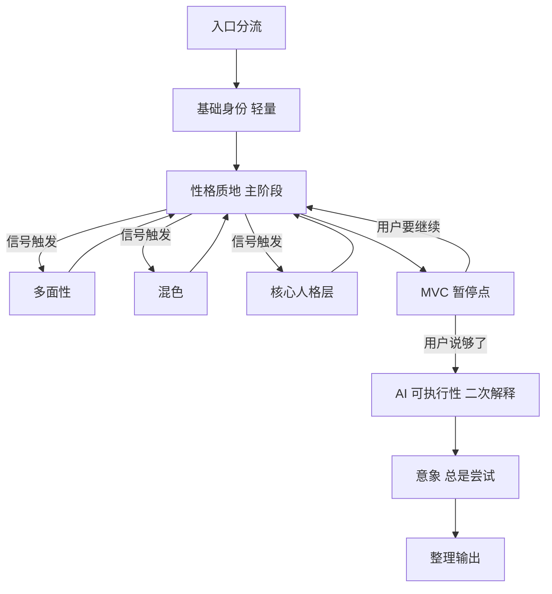

# 06 融合后形态草案

> ⚠️ **这是草案，不是结论。** `04_冲突拍板单.md` 的 11 个冲突和 3 个确认项在你逐条拍板前，本文件不具备权威性。
> 本文件的作用是让你**看见拍板的后果**——每个待定处都标注了它挂在哪个冲突上、不同选法会长成什么样。
> 标注约定：`✅` = 三线已一致或经复核可直接采纳，无需拍板；`🔶 [Cxx]` = 依赖该冲突的拍板结果；`⬜` = 三线共同缺口，需补写。

---

## 〇、融合的基本盘

三条线各自补上了另外两条的空白，融合后的形态可以一句话概括：

> **线 C 的诊断精度 + 线 B 的工程骨架 + 线 A 的协作契约。**

| 层 | 主要来自 | 它解决什么 |
|---|---|---|
| **判断层**：每轮怎么判用户这句话有没有问题 | 线 C | 线 A/B 都只有粗判据，线 C 有三级判定树 |
| **动作层**：判出来了用哪个追问动作、问到什么算够 | 线 C | 线 A 的六类没有完整定义，线 B 只有措辞样本 |
| **流程层**：阶段、深度分支、MVC 暂停、快速路径 | 线 B + 线 C | 线 A 的阶段概念自相矛盾且无快速路径设计 |
| **契约层**：AI 能做什么、什么要确认什么只需告知、谁裁决 | 线 A | 线 B 只有边界表，线 C 几乎空白 |
| **落盘层**：人物文档长什么样、怎么记、怎么续接 | 线 B | 线 A 是它的低精度前身，线 C 空白 |
| **元规则层**：决策怎么记、冲突怎么解 | 线 B | 另外两线无 |

---

## 一、skill 清单与路线图

### 本轮做的（4 个）✅

沿用线 B 的拆分，教程侧有最硬的依据（执行器四禁 + 下游五清单，见 `01` §三）：

| # | slug | 定位 | 状态 |
|---|---|---|---|
| 1 | `char-build-guide` 🔶 [C14] | 追问引擎，主入口。**阻塞项，必须先写** | slug 待定，建议沿用 |
| 2 | `dialogue-persona` | 台词人设，调色盘的**排他替代**（`3.md:35`"要么用调色盘写，要么用台词人设写"） | ✅ |
| 3 | `worldbook-config` | 世界书机制配置（蓝灯/绿灯/位置/深度/递归/关键词） | ✅ |
| 4 | `user-info-calibration` | 用户信息校准。教程明写它是"用户版的二次解释"且**对不抢话党禁写调色盘**（`9.md:240-252`） | ✅ |

### 路线图（线 C 补的）✅

线 C 的 skill 依赖链直接采纳：

```
char-build-guide 产出人物文档
   → 角色卡设计 skill（机制/长期性/开场白）  ⬜ 线 B 自认缺口，线 C 提供了填法
   → worldbook-config 输出世界书条目
角色验证/体检 skill  🔶 [C1] 独立运行，或作为 char-build-guide 的入口模式
dialogue-persona     独立运行（排他替代）
```

---

## 二、文件架构

### 🔶 [C2][C3] 这一块整体挂在两个冲突上

按我在 `04` 的建议（C2 选项 4 + C3 选项 2）画出来是这样：

```
char-build-guide/
├── SKILL.md                          ~150-180 行  🔶 [C3]
│   ├── 身份声明（追问引擎，不是知识手册）           ✅ 线 B
│   ├── 追问深度轴：标签→画面→矛盾→为什么→内核        ✅ 线 B
│   ├── 4 个基础诊断的判定树 + 跨诊断优先级          ✅ 线 C  🔶 [C3] 是否进 body
│   ├── 硬铁律（不替用户生成的准确边界）             ✅ 归并 M-20
│   ├── 执行语言 vs 教学语言 + 2-3 组正反对照句      ✅ 线 B
│   ├── 判停标准（遮名测试）                      ✅ 线 B+C 归并
│   ├── 流程地图 + references 触发指针              ✅ 线 B
│   ├── 入口意识（画面/标签/背景/空白/现成卡）        ✅ 三线归并
│   ├── 标志性问法样本（追问品味内化）               ✅ 线 B
│   └── 降级模式链：镜子→脚手架→推演→溯源→降级       ✅ M-51
└── references/
    ├── palette-guide.md          调色盘（含标签压缩、为什么追问两个动作）
    ├── multi-facet-guide.md      多面性（重模式 8-15 轮）        ✅ 线 C 轻重标注
    ├── color-mixing-guide.md     混色（中等 3-6 轮）
    ├── core-layer-guide.md       核心人格层（重模式 8-15 轮）
    ├── secondary-explanation.md  二次解释（含误读预判动作）
    ├── route-logic.md            多入口路由 + 模式切换 + MVC 判读 + 收束
    ├── case-library.md           教程案例（陈乖乖/姜糖/三明月）  🔶 [线 B §八 🔴]
    ├── question-bank.md          24/80/200 题库，按 80 问十组目标分组  ✅ M-09
    ├── common-mistakes.md        12 失败模式 + 6 执行风险（去重后）
    ├── user-confirm-signals.md   确认信号 + 假信号黑名单         ✅ M-35
    ├── quick-path-guide.md       快速路径五步（G1-G9）
    ├── derivation-frameworks.md  4 核心框架 + 扩展池             🔶 [确认项·框架]
    └── ⬜ probe-world / probe-nsfw 的归宿待定                    🔶 [C2]
```

**每个 reference 内部统一采用线 C 的三段式** ✅ M-41：

```
1. AI 内部诊断（完整判定标准，SKILL.md 里是摘要）
2. AI 对用户的外部问法（2-4 个示例问句，自然语言，不用术语）
3. 质量门（怎么判断用户的回答"够了"可以推进）
```

**归属规则用线 B 的分界测试** ✅ M-34："如果把这条从 body 拿掉，AI 是在**每一轮都可能犯同一个错**，还是**只在某个阶段可能犯某个错**？前者必须在 body。"

⬜ **写 SKILL.md 之前先做体量核对**：把 4 个判定树按实际格式写出来数行数，再回头定 body 预算（线 C 自认从未核对过，本线张力 C/T-20）。

---

## 三、执行流程

### 🔶 [C5] 骨架用线 C 的六阶段 + 插入线 B 的 MVC 暂停



**每一环的来源与状态**：

| 环节 | 内容 | 状态 |
|---|---|---|
| 入口分流 | 现成卡→解析映射到素材区→从标签化处追问（线 A `REVISION §五 6.2` 更细版）／标签→基础身份／模糊感觉→画面钩子 | ✅ M-19 |
| 基础身份（轻量） | 带完整信息来就提取确认，不强制重走。但泛化外貌、结论式背景仍要诊断 | ✅ 线 C |
| 性格质地（主阶段） | 主线追问 + 4 诊断全程运行 + 三类信号监听（场景差异/情绪碰撞/决策深度） | ✅ 线 C |
| 深度分支 | **信号触发，不设关卡。未检测到信号不是漏做，是角色不需要那个层次** | ✅ M-05，教程直接支持 |
| MVC 暂停 | 三层判读（用户主权 > 质量信号 ≥3 > 结构兜底）+ **直说三件事** | ✅ M-17 + 线 A 告知方式；🔶 [C9] 告知语用不用术语；🔶 [C12] 兜底含不含意象 |
| AI 可执行性 | 误读预判 → 二次解释。**组装阶段统一生成，不在构建过程中分散触发** | ✅ M-32，教程直接支持（`06:5-7`）。⚠️ 需修正线 B `§5.1.3` 给的"每个深度层完成后"触发条件 |
| 意象 | **必须尝试，允许跳过**（2-3 个方向都不贴才跳过；"不贴的意象比没有意象更糟"）。写法用线 B `G3` | ✅ M-03 + 原 G-2 |
| 整理输出 | 区分**已确认 / AI 推论 / 待用户决定** 三层 | ✅ M-04，教程执行器同款 |

**快速路径**（线 B G1-G9 完整采纳）✅ M-10：

- 触发：深入模式**连续卡住**（≥2 切面 + ≥2 脚手架被否）→ 不追问原因直接切
- 五步：基础信息 → 小传 → 采访 → 情绪阈值 → 意象（直接来自教程 11）
- MVC 锚点：情绪阈值之后、意象之前
- 🔶 [C13] **双向切换保留吗**——教程只支持单向递进（`11.md:491`）

---

## 四、检查体系：三种检查落在三个时机 ✅ M-08

这是整份融合里最干净的一处，三线各出一块，直接叠加：

| 时机 | 检查 | 来源 | 内容 |
|---|---|---|---|
| **每轮用户输入后** | 4 个基础诊断 | 线 C | 泛化 / 矛盾 / 结论 / 扁平；三级判定（触发/观察/通过）；跨诊断优先级 **矛盾 > 结论 > 泛化 > 扁平**；单轮只处理最高的 1-2 个 |
| **判 MVC 时** | 质量信号 A–G | 线 B | 7 个信号 + **假信号黑名单**（回答变长、用了术语、说"我知道了"、情绪激动都不算）；E 修正精度 / F 自发延伸权重最高 |
| **组装 / 收束时** | 一致性验证 | 线 A | 性格打架吗／衍生矛盾吗／多面性混入二次解释吗／语料移出调色盘了吗／混色解释情绪了吗／防御机制落到行为了吗／意象从核心矛盾长出来了吗 |

**线 C 的三条核心纪律一并采纳** ✅：只追问不指责 / **四个诊断词永远不对用户说** / 灰色地带默认走"观察"。
**可复现性目标** ✅：同一段用户输入，AI 10 次判断应得到 10 次一样的结果。

🔶 [C6] 扁平检测教程无直接判据，保留 / 降级 / 移除待定。
⬜ [G-1] 4 个诊断的**外部问法与质量门**目前无处安放——三线共同缺口。

---

## 五、AI 的行为契约（线 A 的主场）

### 推演权限 ✅ M-20（统一措辞）

采用线 B `§1.4` 的表格版本，**删掉 `§2.2` 的绝对化句子**：

| AI 应该做 | AI 不应该做 |
|---|---|
| 追问 → 帮用户自己想出来 | 用户说"不知道"时替她生成答案 |
| 从用户已有行为中找出模式，推给用户确认 | 替用户编一个她没有描述过的行为或特质 |
| 用专业框架诊断用户描述属于哪个深度 | 把术语直接抛给用户 🔶 [C9] |
| 帮用户把模糊的描述推到具体、独有的画面 | 在用户确认前替她做总结 |

加上线 A 的两条硬规则 ✅ M-30：**推演禁止出形容词，只许出行为场景**；每条推演标注三要素（行为场景 / 心理机制 / **从哪段经历推出来的**——闭环可回溯）。

**教程侧支持这个边界**：教程内部有真实张力（`02:57` 禁止代写衍生 vs mentor 反复代写、`04:108-118` 混色画面全部代写），唯一自洽的解读是"**AI 可凝练命名并提交确认，不得引入用户没说过的内容**"。

### 确认 vs 同步 🔶 [C10]

线 A 的二分在**构件侧**三线一致 ✅ M-12：AI 产生新内容（推演候选、转写、构件命名）**必须确认**，形式用线 B 的自然语言投影。

**素材过滤侧待拍板**：线 A"必须同步" vs 线 B"静默"。我建议的选项 3（丢弃型静默、降级型同步并顺势追问那个情境）长这样：

```
用户："她喜欢听音乐。"
→ AI 内部判定：可降级（加个情境限制就有价值）
→ AI 外部：不通报过滤，直接追问 —— "她一般什么时候听？一个人的时候还是有人在？"
```

### 卡住处理 🔶 [C13]

**降级模式链**（管 AI 扮演什么角色）✅ M-51，线 A 与线 B `E_SECTION 决策 6` 归并：

```
镜子（只反射用户说的）→ 脚手架（给试探方向让用户否定）→ 推演（多路径候选）→ 溯源 → 降级路径
```

切换依据两线一致：**产出质量，不是固定轮数**。

**引导升级阶梯**（管引导强度）线 B `G6`：钻探链 → 回链+行为锚定 → 多选行为引导 → 假设场景。永远从最轻开始，先诊断卡住类型再匹配机制。

🔶 [C13] 两套怎么分工待定。

**示范三条硬约束** ✅ M-39：不写用户的角色 / 只示范一条并明确交还 / "找到"型任务（意象、底色）不示范。

⬜ [G-6] **核心人格层"作者答不出"时应当跳过这一层**——教程明写（`05:57-62`），三线都没落成规则。

---

## 六、人物文档

线 B 的 L1–L12 直接采纳 ✅ M-15（它是线 A 的超集，且线 B 自己记录了吸收来源）：

```
# <角色名>                                    ✅ L1

## 索引头（每次进入必读，20 行内）              ✅ L8
- 当前进度 / 统计（✅N 📌N 🔄N）
- 正在挖（🔄）        ← 这就是线 A 要的"最近更新的具体位置标记" ✅ M-16
- 未深挖清单（📌 ≤5 条）  ← 埋没点登记制 ✅ M-37
- 已确认清单（✅）
- 断点记录
- 已推翻/搁置（简写）
- 🔶 [C11] 意象摘要一行？

## 素材区（她经历过什么）                       ✅ L2/L3
### 关系动态切片 → 行为切片 → 标志性偏好习惯 → 经历事件    （按检索频率排）
每条：[编号] [🔄/📌/✅] [标题] ⏸日期 / 用户原话 / 整理 / 被引用于
      ↑ 轮后静默拆解记录，原话锚 + 最小加工 ✅ L6
      ↑ 教程执行器同款：用户原回答与整理后的思路强制分栏（工作流:70-78）

## 构建区（她是什么样的人）                     ✅ L4 + M-50
### 基础信息
### 调色盘（底色→主色调→点缀→衍生）   > 依赖链注释：这是文档框架顺序，不是追问顺序
### 多面性（如有，五部件+过渡+渗透）
### 混色画面（如有）
### 核心人格层（如有，七部件）
### 二次解释
### 意象                                🔶 [C11] 排这里还是排最前
每条构件：← 支撑素材 [M-B03][M-B12]
      ↑ 确认时用自然语言投影，不用术语格式 ✅ L10

## 归档区                                     ✅ L9
### 推翻记录（原因+日期+影响范围）  ← 素材是事实不动，构建是解读可推翻 ✅ M-38
### 旧版本
```

**记录粒度** ✅ M-24/M-25：事件驱动（特征闭环即记录，每轮不自动写）；角色相关的否决 → 原因进素材区；纯协作否决 → 不落盘；**过程记录/追问日志不设独立区**（线 A `§2.4` 与线 B `L12` 独立得出同一结论）。

**最终卡导出** ✅ L11：用户手动触发，内容 = 构建区按依赖链组装。怎么转世界书格式是 `worldbook-config` 的事。
🔶 [C12] 导出时是否要求意象已尝试过。

---

## 七、术语策略 🔶 [C9] —— 整份草案里唯一的 L3 待定

这一条不定，下面全部悬空：

| 挂在 C9 上的 | 选项 1（全程零术语） | 选项 3（分层，我的建议） |
|---|---|---|
| MVC 告知语 | "还可以往下走两三个方向，要继续吗？" | "还可以聊她在不同场合的样子（多面性）、情绪撞在一起的瞬间（混色）、她为什么做那些选择（核心人格层）" |
| 产物名要不要定 | 不用定，`DISCUSSION_01 议题 6` 关闭 | 要定（情感混色 / 角色边界 等，线 A 本线未决） |
| I 段 | 完全不出现术语 | 完全不出现术语（两个选项在 I 段一致） |
| 人物文档构建区小节名 | 用自然语言（"她在不同场合的样子"） | 用产物名 + 首次带括号方法名 |
| probe 外部问法 | 零术语 | 零术语（两个选项在追问过程一致） |

⚠️ **拍板前请务必看 `04` C9 的教程证据**——那一条经证伪复核后**方向反转了**：教程唯一写给 AI 执行的规范（24/80/200 问执行器）**满屏术语且由 AI 主动定义**，"全程零术语"在教程里没有原型。

---

## 八、融合前必须先做的事

| # | 事项 | 为什么必须先做 |
|---|---|---|
| 1 | **6 条各线内部张力自裁**（`03` §〇之三） | 不裁的话，相关格子无法定论 |
| 2 | **拍板 `04` 的 3 个确认项 + 11 个冲突**（按依赖图的批次顺序） | 本草案 🔶 处全部悬空 |
| 3 | **SKILL.md 体量核对** | 线 C 自认从未核对过 4 诊断判定树的实际行数 |
| 4 | **补 6 个共同缺口**（G-1、G-3～G-8） | 融合后仍是洞 |
| 5 | **修正线 B `§5.1.3` 的二次解释触发条件** | "每个深度层完成后"与教程 `06:5-7` 和线 A `§2.13` 都冲突，且是线 B 自己的张力 B/T25 |
| 6 | **清理另外 77 条内部张力** | 不影响跨线结论，但影响融合后文档的自洽 |

---

## 九、这份草案没有做的事

- **没有替你拍板**——所有 🔶 处保持开放
- **没有写任何 SKILL.md 正文**——那是阶段 2 的事，且阻塞于拍板
- **没有修改三线任何原文件**，也没有动 `AGENTS.md`
- **没有引入三线之外的新设计**——本草案的每一条都能追溯到某条线或教程原文
